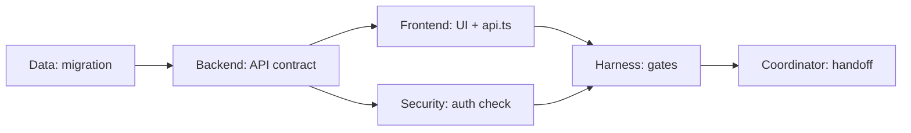

# Multi-Agent Coordination

> Related: [MCP_AGENT_WORKFLOW](MCP_AGENT_WORKFLOW.md) | [AGENT_HARNESS](AGENT_HARNESS.md) | [AGENTS](../AGENTS.md) | [handoff-packet-template](handoff-packet-template.md)

Five subagents + one **Coordinator** (parent). Coordinator owns DAG, shared configs, merge, and final gate — not feature code.

## When to spawn five vs one

| Spawn **5** | Use **1** |
|-------------|-----------|
| ≥2 ownership zones (e.g. `frontend/` + `src/` + `migrations/`) | Single-file or doc-only fix |
| Phase plan with parallel leaves | Read-only review |
| Full-stack feature with frozen contracts | Work confined to one zone |

## Roster (5 subagents)

| # | Role | Domain | Primary paths |
|---|------|--------|---------------|
| 1 | **Backend Core** | Axum `/api/v2`, MCP server, auth middleware, crawler | `src/` (excl. migration-only) |
| 2 | **Frontend Surface** | Next.js, Tailwind, client API wiring | `frontend/` |
| 3 | **Data & Schema** | Migrations, SQLx, RLS SQL, `sqlx prepare` | `migrations/`, schema modules |
| 4 | **Harness & Deploy** | Scripts, CI, Docker, MCP config, gates | `scripts/`, `.github/`, `Dockerfile*`, `.grok/`, `.cursor/` |
| 5 | **Security & Trust** | Auth, admin gates, install_safety, x402 boundaries | auth/trust modules, `docs/SECURITY.md` |

**Coordinator** — DAG, `git status`, handoff merge, `agent-harness-check.sh`, user summary.

## Coordination rules

1. **Before spawn** — `git status --short`; assign **exclusive file globs** per agent; shared roots (`Cargo.toml`, `lib.rs`) are Coordinator-only unless handed off.
2. **One writer per path** — no parallel edits on the same file; integration seams are **serialized** (schema → API contract → frontend types).
3. **Phase gates** — stop parallel work at sync points: migration landed → `sqlx prepare` → handlers; API contract frozen → frontend wires.
4. **Handoff packet required** — template: [handoff-packet-template](handoff-packet-template.md).
5. **MCP routing** — see [MCP_AGENT_WORKFLOW](MCP_AGENT_WORKFLOW.md); subagents use read-only MCP unless user approved a mutating action.
6. **Per-zone verification** — Backend: `cargo test/clippy/fmt`; Frontend: `npm run lint && npm run build`; Data: migrate + `sqlx prepare`; Harness: `agent-harness-check.sh`; Security: auth/admin review on touched paths.
7. **Coordinator runs full gate** before user handoff when UI or cross-stack scope applies.
8. **No auto CI/review bots** — `workflow_dispatch` and CodeRabbit/qodo only on explicit user request; `[skip ci]` when push should run nothing.
9. **Multi-machine** — handoff packets list env *names*, not OAuth tokens; MCP auth is per device.
10. **Parent synthesis** — one doc update per task (not per subagent); one user-facing summary with DAG status, commands run, open risks.

## QA sub-chain (within a phase)

| Step | Role | Duty |
|------|------|------|
| QA-1 | Scope Classifier | Emit change type: UI-only / API-only / full-stack / deploy |
| QA-2 | Rust/API Verifier | `cargo test/clippy/fmt`, `sqlx prepare` if schema |
| QA-3 | Harness Verifier | `agent-harness-check.sh`, readiness report if multi-agent |
| QA-4 | UI Verifier | `ui-change-gate.sh` at correct tier |
| QA-5 | Deploy Verifier | `release-build.sh`, `verify-bundle.sh`, post-deploy smoke |

Chain: QA-1 → (QA-2 ∥ QA-3) → QA-4 (if UI/full-stack) → QA-5 (if deploy) → Coordinator sign-off.

## Verification matrix

| Gate | UI-only | API-only | Full-stack | Deploy |
|------|:-------:|:--------:|:----------:|:------:|
| `git status --short` | ✓ | ✓ | ✓ | ✓ |
| `cargo check --features ssr` | if Rust touched | ✓ | ✓ | ✓ |
| `cargo test --features ssr` | if server touched | ✓ | ✓ | ✓ |
| `cargo clippy` + `fmt --check` | if Rust touched | ✓ | ✓ | ✓ |
| `npm run build` (`frontend/`) | if frontend touched | — | if frontend touched | if frontend touched |
| `sqlx prepare` | if schema | ✓ | ✓ | ✓ |
| `agent-harness-check.sh` | ✓ | if harness/docs | ✓ | ✓ |
| `ui-change-gate.sh` (full) | ✓ handoff | — | ✓ handoff | if UI in release |
| `agent-readiness-report.sh` | multi-agent | optional | ✓ | ✓ |
| `release-build.sh` + `verify-bundle.sh` | — | — | optional | ✓ |
| `post-deploy-verify.sh` | — | — | — | ✓ |

✓ = required before handoff; conditional = when path touched; — = skip unless scope expands.

## Example DAG (full-stack feature)

## Anti-pattern

Five agents editing the same API JSON contract in parallel without a frozen handoff packet — causes type drift, double deploys, and false “stale bundle” diagnoses. Serialize the seam.