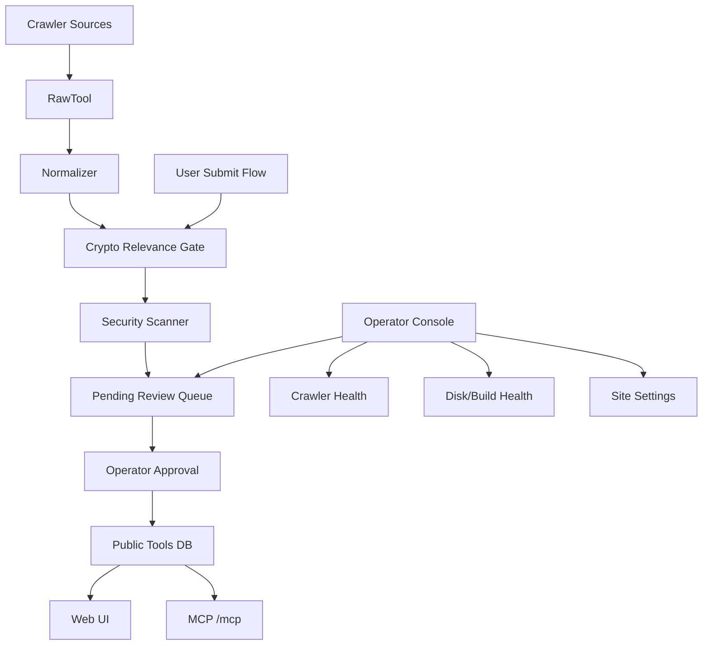

# Operator product hardening — design spec

This spec turns OnchainAI from a working crawler-backed directory into a safer,
operator-friendly crypto tool registry that humans and agents can trust.

It covers four goals:

- Fix behavior that currently conflicts with the product intent.
- Make it easy for the operator to manage the site without editing the DB.
- Keep local maintenance safe, especially Rust/Leptos build output growth.
- Make submission and discovery safer: crypto-relevant, security-screened, and
  simple for users.

Related docs: [MVP_DESIGN.md](../../MVP_DESIGN.md),
[UI_UX_DESIGN.md](../../UI_UX_DESIGN.md), [SECURITY.md](../../SECURITY.md),
[DESIGN.md](../../../DESIGN.md), [AGENTS.md](../../../AGENTS.md).

## Product Intent

OnchainAI should be a crypto tool registry for humans and agents.

- Humans use the web UI to search, compare, trust-check, and install tools.
- Agents use the `/mcp` endpoint to search tools and retrieve install guidance.
- Crawlers keep the catalog fresh.
- Operators curate quality, safety, and relevance.

The product should not become a generic MCP directory. A tool belongs only if it
helps with onchain, crypto, wallet, DeFi, RWA, x402, blockchain data, crypto AI
agent, or crypto developer workflows.

Acquisition north star:

> OnchainAI wins when high-value crypto tools are discoverable, installable,
> trusted, and kept fresh by their owning projects.

Core metrics:

- Discovered candidates.
- Reviewed candidates.
- Public approved tools.
- Trusted tools (`verified` or `official`).
- Claimed listings.
- Listing views.
- Install-command copies.
- MCP search/detail/install-guide calls.
- Stale listing rate.
- Report resolution time.

## Current Mismatches and Bugs

### B1. Production server-function argument mismatch

Observed screenshot: `error deserializing server function arguments: missing field
filters`.

Likely cause: deployed SSR/client/server-function bundle mismatch, stale generated
WASM, or a server function signature change not matched by the served client.

Required fix:

- Add a deployment smoke test for `/`, `/tools`, and one filtered URL such as
  `/tools?function=bridge&type=mcp`.
- Add a CI or deploy script check that verifies the generated client bundle and
  server binary come from the same build.
- Prefer one stable request payload struct for browser list queries instead of
  frequently changing positional server function args.

Acceptance:

- No user-facing server function deserialization error on `/` or `/tools`.
- A failed smoke test blocks deploy.

### B2. Disk guard is documented but missing

`AGENTS.md` says to run `./scripts/disk-guard.sh`, but the file does not exist.
Current `target/` size observed locally: 11GB. The project already warns that
Leptos SSR + WASM builds can exceed 50GB.

Required fix:

- Add `scripts/disk-guard.sh`.
- Add `scripts/clean-build-artifacts.sh`.
- Add docs that explain when to run each script.

Acceptance:

- `./scripts/disk-guard.sh` exits non-zero if free disk is below a configured
  threshold or `target/` exceeds a configured threshold.
- `./scripts/clean-build-artifacts.sh` removes safe generated artifacts only:
  `target/`, `target-leptos/` if used, stale `.playwright-cli` screenshots/logs
  older than a configurable age, and temporary build outputs.
- Scripts never remove `.env`, migrations, source files, checked-in docs, or
  user-created data.

### B3. Submit UX promises more than the product supports

Home promo text says users can submit tools and x402 tools can pay per
registration, but `/about#submit` currently says MVP registration is GitHub issue
only.

Required fix:

- Until self-service exists, change the promo copy to match reality.
- Then implement self-service submission as a first-class flow.

Acceptance:

- Public copy never promises a feature that is not available.
- When self-service ships, `/submit` replaces `/about#submit` as the primary CTA.

### B4. Install guide can produce unsafe or invalid commands

Current detail content builds Claude config from a raw install string. Wrapping
unknown text in shell config is risky and can break JSON escaping.

Required fix:

- Store install guidance as structured data:
  `install_kind`, `package_manager`, `command`, `args`, `env_requirements`,
  `requires_secret`, `risk_level`.
- Render copyable commands from structured fields.
- For untrusted tools, show a safety warning when the command uses `curl | sh`,
  remote shell scripts, unknown binaries, or shell metacharacters.

Acceptance:

- No generated config embeds raw unescaped install text into JSON.
- Risky install commands are visible to the user and admin before approval.

### B5. Crypto relevance is too permissive

The crawler can ingest broad npm/GitHub results from generic terms like `mcp`.
Some tools may be useful MCP tools but not crypto tools.

Required fix:

- Add a relevance gate before approval.
- Store `crypto_relevance_score`, `crypto_relevance_reasons`, and
  `relevance_status` (`accepted`, `needs_review`, `rejected`).
- Auto-accept only when strong crypto/onchain signals exist.

Acceptance:

- Generic MCP tools without crypto/onchain signals do not appear publicly.
- Admin can override with a reason.

## Recommended Approach

Use an incremental hardening track, not a rewrite.

### Option A: Patch only visible bugs

Fastest, but it leaves the operator dependent on DB edits and ad hoc judgment.
Not recommended.

### Option B: Operator-first hardening

Fix the live bug, disk guard, submission truthfulness, admin review, relevance,
and install safety in one focused track. Recommended.

### Option C: Full marketplace rebuild

Add payments, verification, self-service, analytics, and recommendations all at
once. Too broad for this phase.

Decision: use Option B.

## Target System Map



## Phase 1: Stability and Maintenance

### 1.1 Deploy/build compatibility guard

Add smoke tests after build/deploy:

- `GET /` returns 200 and contains `OnchainAI`.
- `GET /tools` returns 200 and does not contain `error deserializing`.
- `GET /tools?function=bridge&type=mcp` returns 200 and does not contain
  `missing field filters`.
- `POST /mcp` initialize returns valid JSON-RPC response.

Implementation notes:

- Add `scripts/smoke-test.sh`.
- Run it locally against `localhost:3000` and in deploy instructions against
  `https://www.onchain-ai.xyz`.
- Keep output short: status, failed URL, first relevant error line.

### 1.2 Stable browser query payload

Replace multi-argument list server calls with a stable struct:

```rust
pub struct ToolListRequest {
    pub sort: String,
    pub offset: i64,
    pub limit: i64,
    pub filters: ToolFilters,
    pub query: Option<String>,
}
```

Expose one server function:

```rust
#[server(ListToolsV1, "/api")]
pub async fn list_tools_v1(req: ToolListRequest) -> Result<Vec<Tool>, ServerFnError>
```

Keep the existing `list_tools` wrapper temporarily for internal call sites.

Acceptance:

- Existing home, tools page, and category page all use `list_tools_v1`.
- A future added field can have a default without breaking deployed clients.

### 1.3 Disk hygiene scripts

Add `scripts/disk-guard.sh`:

- Shows free disk, `target/` size, `target/site` size, `.playwright-cli` size.
- Fails before heavy build when free disk is below 25GB or `target/` exceeds
  35GB, unless `ONCHAINAI_DISK_GUARD_FORCE=1`.
- Recommends the exact cleanup command.

Add `scripts/clean-build-artifacts.sh`:

- `cargo clean` by default.
- Optional `--playwright-days N` to remove old Playwright artifacts.
- Optional `--dry-run`.
- Never follows symlinks outside the repo.

Update commands:

- Before local `cargo leptos build --release`, require `./scripts/disk-guard.sh`.
- Prefer Railway/Docker builds for production.
- For routine Rust checks, prefer `cargo check --features ssr` before heavy
  release builds.

## Phase 2: Operator Console

### 2.1 Admin home becomes an operations dashboard

Replace the current admin link list with a dashboard.

Cards:

- Pending tools count.
- Rejected last 7 days.
- Crawler health by source.
- Last successful crawl per source.
- MCP endpoint status.
- Public tool count.
- Disk/build hygiene status for local/dev when available.

Quick actions:

- Run selected crawler.
- Sync GitHub stars.
- Review pending tools.
- Edit site copy.
- Open smoke test instructions.

Acceptance:

- Operator can understand site health in under 30 seconds.
- No DB console is needed for normal review and settings work.

### 2.2 Review queue redesign

Each pending tool row should show:

- Name, source, source URL, repo/homepage.
- Classification: function, asset class, actor, type.
- Crypto relevance score and reasons.
- Install safety score and warnings.
- Duplicate candidates.
- Chain list.
- Stars and last commit.
- Buttons: Approve, Reject, Needs Info, Mark Official, Mark Verified.

Approval requires:

- Crypto relevance accepted.
- No critical install safety issue.
- At least one trustworthy URL: repo, homepage, npm package, or MCP endpoint.

Override:

- Admin can override relevance or safety with a required reason.
- Override reason is stored and visible in audit history.

### 2.3 Audit trail

Add `tool_review_events`:

- `tool_id`
- `admin_id`
- `action`
- `reason`
- `before_status`
- `after_status`
- `created_at`

Acceptance:

- Every approve/reject/override action creates an event.
- Admin UI shows recent review history per tool.

## Phase 3: User Submission Flow

### 3.1 Public `/submit`

Authenticated users can submit a tool without GitHub issues.

Form fields:

- Tool name.
- Description.
- Tool type: MCP, CLI, SDK, API, x402, Skill.
- Repo URL.
- Homepage.
- npm package.
- MCP endpoint.
- Install command.
- Supported chains.
- Category suggestion.
- Official team claim checkbox.
- Contact/verification note.

Validation:

- Name: 2-100 chars.
- Description: 20-500 chars.
- URLs: only `https://` except localhost in dev.
- Install command: max length, no raw newlines, scanned for risky patterns.
- Chains: from allowlist plus "Other" with review.
- Tool can be submitted if minimally plausible; crypto relevance gates public
  approval, not intake. Low-confidence submissions enter `needs_manual_research`.

Submission status:

- User sees `pending`, `approved`, `rejected`, or `needs_info`.
- Rejection includes a clear reason.
- Users can edit and resubmit rejected or needs-info tools.

Acceptance:

- Non-admin user can submit a valid crypto tool.
- Submitted tool is never public until approved.
- User can see their own submission status.

### 3.2 Discovery and growth loop

OnchainAI needs two acquisition loops:

- **Operator-led discovery** for cold start and quality coverage.
- **Project-led submission/claiming** so teams eventually keep their own listing
  fresh.

The system should not depend on the operator manually hunting every new project
forever. The operator's job should become review and curation, not data entry.

#### Source discovery

Keep crawler discovery, but split discovered items into clear buckets:

- `new_candidate`: newly found, never reviewed.
- `known_update`: existing tool changed materially.
- `low_relevance`: probably not crypto-related.
- `needs_manual_research`: unclear but potentially important.

Listing lifecycle:

- `candidate`: discovered but not reviewed.
- `pending`: submitted or promoted into review.
- `public_unclaimed`: visible but not owned by the project.
- `claim_pending`: a project has started verification.
- `claimed`: owner verified, but edits still go through safety gates.
- `flagged`: report or scanner found a potential issue.
- `stale`: important metadata has not been reviewed recently.
- `deprecated`: project appears inactive or superseded.
- `delisted`: removed from public discovery.

Discovery priority score:

```text
priority_score =
  crypto_relevance
  + trust_signal
  + demand_signal
  + coverage_gap
  + freshness
  - safety_risk
```

The operator queue should sort by `priority_score`, not only newest first.

Signals that create a `new_candidate`:

- GitHub topics: `crypto-mcp`, `web3-mcp`, `blockchain-mcp`, `onchain`,
  `defi`, `wallet`, `x402`, `rwa`, `agentkit`, `ai-agent`.
- npm keywords and package names with crypto/onchain terms.
- Mentions from known source registries.
- Existing official project repos adding MCP/agent docs.
- A listed project's README adding a new install command or MCP endpoint.

Signals that create a `known_update`:

- New release or version.
- Changed install command.
- New MCP endpoint.
- New supported chains.
- GitHub stars crossing a configured threshold.
- Last commit recency changing from stale to active.
- Tool moving from community to official evidence.

Acceptance:

- Admin has separate queues for new candidates and updates.
- Updates can be approved faster than brand-new tools.
- Existing public listings show "last reviewed" and "last detected update".

#### Operator-led outbound

The admin console should include an "outreach queue" for high-value projects that
were discovered but not claimed.

Each outreach item shows:

- Project name.
- Why it matters.
- Suggested contact channel: GitHub issue, website contact, X profile, Discord,
  or repo discussion.
- Prewritten short message.

Default message:

> We found an unofficial listing for your crypto tool on OnchainAI. You can
> claim it to verify official details, correct install instructions, and keep
> the listing fresh: <claim link>

Acceptance:

- Operator can copy an outreach message in one click.
- Outreach status is tracked: not contacted, contacted, claimed, declined,
  ignored.

#### Project-led claim flow

Every public tool detail page should have "Claim this listing".

Claim verification methods:

- GitHub OAuth user has admin/write access to the listed repo.
- Official domain email challenge.
- DNS TXT challenge for project domain.
- Manual admin verification with evidence note.

Claim governance:

- Claim status is separate from trust tier.
- Official badge is never automatic just because a listing is claimed.
- Repo or domain ownership changes require re-verification.
- Disputes move the listing to `disputed` or `flagged` until resolved.
- Claim revocation requires an audit event with reason.
- Takedown requests are stored as review events and do not silently delete
  history.

Claimed listing permissions:

- Submit edits to description, install command, supported chains, homepage,
  repo, MCP endpoint, and docs.
- Request official badge.
- Upload logo or brand image once the listing is claimed and reviewable.
- View listing reports for their tool.

Safety rule:

- Claimed edits still go through review if they change install command, MCP
  endpoint, homepage domain, or official status.

Acceptance:

- A legitimate project can claim without emailing the operator manually.
- Dangerous edits cannot bypass review just because the listing is claimed.

#### Update suggestion flow

Unauthenticated users can suggest a correction; authenticated users can track
their suggestion.

Suggestion types:

- Broken link.
- Wrong category.
- New install command.
- New chain support.
- Security concern.
- Not crypto-related.
- Duplicate listing.

Acceptance:

- Suggestions create an admin queue item.
- Security concern suggestions are prioritized.
- Repeated reports can temporarily flag a listing for review.

### 3.3 Duplicate detection

Before saving:

- Normalize repo URL.
- Normalize npm package.
- Normalize homepage domain.
- Compare slug/name similarity.

If duplicate likely:

- Show existing tool.
- Let user suggest an update instead of creating a new listing.

Acceptance:

- Same repo cannot create multiple public tools unless admin explicitly allows.

### 3.4 Who should add products?

Use staged ownership:

1. **Now:** operator plus crawler populate the directory. This solves cold start.
2. **Next:** users submit missing tools through `/submit`. This reduces operator
   data entry.
3. **Then:** projects claim listings and maintain their own metadata. This keeps
   data fresh.
4. **Always:** OnchainAI keeps final publication control through relevance,
   safety, and admin review.

This balance keeps the catalog growing without letting it become spammy or
off-topic.

## Publication Invariant

Public visibility is stricter than `approval_status = 'approved'`.

Every public surface must use the same rule:

```text
PUBLIC_TOOL_WHERE =
  approval_status = 'approved'
  AND relevance_status = 'accepted'
  AND install_risk_level <> 'critical'
  AND quarantined_at IS NULL
```

This invariant applies to:

- Supabase RLS public `SELECT` policy.
- Leptos server functions.
- `/mcp` search/detail/category/install guide queries.
- Category counts.
- Comment counts attached to public tool rows.
- Any future public API.

Existing rows must be backfilled conservatively. A row that was previously
`approved` must not remain public unless it has passed relevance and install
safety checks or has an explicit admin override reason in the audit trail.

## Phase 4: Crypto Relevance and Safety Gates

### 4.1 Crypto relevance scoring

Signals:

- Strong positive: chain names, wallet, DeFi protocols, RWA, x402, MCP for
  onchain data, contract tooling, crypto npm keywords, GitHub crypto topics.
- Medium positive: web3, blockchain, token, NFT, oracle, indexer.
- Negative: generic productivity, generic filesystem MCP, weather, calendar,
  unrelated SaaS, no crypto terms.

Recommended schema:

```sql
ALTER TABLE tools ADD COLUMN crypto_relevance_score INT NOT NULL DEFAULT 0;
ALTER TABLE tools ADD COLUMN crypto_relevance_reasons TEXT[] NOT NULL DEFAULT '{}';
ALTER TABLE tools ADD COLUMN relevance_status TEXT NOT NULL DEFAULT 'needs_review';
ALTER TABLE tools ADD COLUMN review_notes TEXT;
```

Status rules:

- `score >= 70`: accepted unless safety critical.
- `40 <= score < 70`: needs review.
- `score < 40`: rejected from public listing unless admin override.

Acceptance:

- Crawled generic MCP tools stay pending/rejected.
- Admin can explain why a borderline tool was accepted.

### 4.2 Install safety scanner

Risk levels:

- `low`: package-manager install with known package field.
- `medium`: command requires env vars or API keys.
- `high`: shell metacharacters, remote scripts, unknown binary, writes config.
- `critical`: destructive shell commands, credential exfiltration patterns,
  obfuscated command text.

Scanner output:

- `install_risk_level`
- `install_risk_reasons`
- `requires_secret`
- `safe_copy_command`

Acceptance:

- Public UI shows warnings for medium/high risk.
- Critical risk cannot be approved without admin override.
- MCP install guide includes risk warning text for risky tools.

### 4.3 Trust tiers

Replace vague trust with explicit tiers:

- `community`: discovered or user-submitted, basic checks passed.
- `verified`: OnchainAI checked source ownership and install safety.
- `official`: controlled by the official project/team.

Official requires evidence:

- Official domain links to repo, or repo org matches project, or verified team
  contact.

Acceptance:

- Admin cannot mark official without an evidence note.
- UI explains each tier briefly in the detail page.

## Phase 5: UI Improvements

### 5.1 Homepage truthfulness

Before self-service:

- CTA: "Suggest a tool" and GitHub issue path.
- Remove x402 registration payment copy.

After self-service:

- CTA: "Submit a tool".
- Show "reviewed before publication" clearly.
- Keep MCP connection card.

### 5.2 Tool detail trust panel

Add a clear trust panel:

- Source.
- Last crawl.
- Last commit.
- Install risk.
- Crypto relevance.
- Verification evidence.
- Report listing button.

### 5.3 User-friendly registration

Use a guided form, not a long admin-like page:

1. What are you submitting?
2. Where is it published?
3. How do users install/connect it?
4. Which chains/categories does it support?
5. Review and submit.

Each step should save progress locally and show validation inline.

### 5.4 Empty state

When filters return no result:

- Offer clear filters.
- Offer submit/suggest tool.
- Show current filters in plain language.

## Phase 6: Security and Abuse Prevention

### 6.1 Server-side validation

All submit/admin mutations validate:

- URLs.
- enum values.
- text lengths.
- install command length and risk.
- chain IDs.
- category IDs.

### 6.2 Rate limits

Add stricter limits:

- Submit tool: 5/hour/user.
- Comment: 10/min/user.
- Bookmark toggle: 60/min/user.
- MCP: separate public IP limit to avoid blocking normal web browsing.

### 6.3 Reporting and moderation

Add "Report listing" for:

- Scam/phishing.
- Unsafe install.
- Wrong category.
- Not crypto-related.
- Broken link.

Admin page shows report queue.

### 6.4 Secret safety

Rules:

- Never display `SUPABASE_SERVICE_KEY` or `JWT_SECRET`.
- Never ask users to paste secrets into OnchainAI for normal listing.
- Install guides can mention required env vars by name, but not values.

## Phase 7: Hermes Operator Agent and Harness

Hermes can manage the site, but only as an operator assistant with a narrow,
audited harness. Hermes should not be a free-form agent with full DB and shell
authority.

Recommended role split:

- **Human operator:** sets policy, approves sensitive changes, owns final trust.
- **Hermes:** monitors queues, drafts actions, runs bounded checks, proposes
  review decisions, and executes approved low-risk operations.
- **Specialist droids:** implement code or deep checks when needed. Existing
  `.factory/droids/crawler-worker.md`, `rust-builder.md`, and
  `security-checker.md` can remain implementation specialists, not daily
  operators.

### 7.1 What Hermes should do

Hermes should handle repetitive operational work:

- Summarize daily site health.
- Surface new crawler candidates.
- Rank pending tools by relevance and risk.
- Draft approve/reject recommendations.
- Detect listings that changed materially.
- Draft outreach messages to unclaimed projects.
- Prepare release checklists.
- Run smoke tests and report failures.
- Suggest cleanup when build artifacts are too large.

Hermes may execute automatically only for low-risk actions:

- Mark duplicate candidates as "needs review".
- Open an internal admin task.
- Refresh crawler status.
- Draft, but not publish, outreach copy.
- Run read-only health checks.

Hermes must ask for human approval before:

- Approving or rejecting a public listing.
- Marking a listing `official` or `verified`.
- Changing install commands, MCP endpoints, or homepage domains.
- Running deploys.
- Running cleanup that deletes files.
- Changing auth, RLS, secrets, or security policy.

### 7.2 Harness goals

The harness should make Hermes token-efficient and safe.

Principles:

- **Snapshot first:** Hermes reads compact JSON summaries, not whole tables or
  long logs.
- **Budgeted context:** every operation declares max rows, max bytes, and
  allowed files.
- **Typed actions:** Hermes returns structured proposed actions, not prose-only
  decisions.
- **Evidence links:** every recommendation cites source URLs, DB ids, or command
  outputs.
- **Diff-based review:** Hermes receives changed fields, not entire records,
  when evaluating updates.
- **No secrets:** harness responses redact secrets before reaching Hermes.
- **Human checkpoints:** risky actions require explicit operator approval.

### 7.3 Harness surfaces

Add a small internal operator API, admin-only:

```text
GET  /admin/api/harness/snapshot
POST /admin/api/harness/evaluate-tool
POST /admin/api/harness/evaluate-update
POST /admin/api/harness/draft-outreach
POST /admin/api/harness/run-smoke
POST /admin/api/harness/propose-cleanup
```

These routes are not public product APIs. They are compact operational endpoints
for Hermes and the admin UI.

#### `harness/snapshot`

Returns a bounded dashboard snapshot:

```json
{
  "generated_at": "2026-06-26T00:00:00Z",
  "counts": {
    "public_tools": 1234,
    "pending_candidates": 42,
    "known_updates": 9,
    "high_risk_installs": 3,
    "open_reports": 5
  },
  "crawler_sources": [
    {
      "name": "github",
      "status": "success",
      "last_crawled_at": "...",
      "items_found": 120,
      "error_short": null
    }
  ],
  "top_attention_items": [
    {
      "kind": "pending_tool",
      "id": "...",
      "title": "Example MCP",
      "reason": "high relevance, medium install risk"
    }
  ]
}
```

Hard limits:

- Max 50 attention items.
- Max 2KB per item.
- No descriptions longer than 300 chars.
- No raw install command longer than 500 chars.

#### `harness/evaluate-tool`

Input:

- Tool id or candidate id.
- Optional requested policy version.

Output:

```json
{
  "recommendation": "approve|reject|needs_info|manual_review",
  "confidence": 0.0,
  "crypto_relevance": {
    "score": 82,
    "reasons": ["repo topic crypto-mcp", "description mentions wallet"]
  },
  "install_safety": {
    "risk": "low|medium|high|critical",
    "reasons": []
  },
  "required_human_decision": true,
  "suggested_admin_note": "..."
}
```

Hermes should use this instead of rereading crawler code or full DB rows.

#### `harness/evaluate-update`

Input is a field-level diff:

```json
{
  "tool_id": "...",
  "changed_fields": {
    "install_command": {
      "old": "npm i old",
      "new": "curl https://example.com/install.sh | sh"
    }
  }
}
```

Output:

- Risk classification.
- Whether public listing should be temporarily flagged.
- Whether human approval is required.

#### `harness/draft-outreach`

Input:

- Tool id.
- Contact channel.
- Tone: `short`, `formal`, or `friendly`.

Output:

- One short outreach message.
- Claim URL.
- Evidence summary.

Hard limit:

- Message under 900 chars.
- No unverifiable claims.

#### `harness/run-smoke`

Runs bounded smoke checks:

- `/`
- `/tools`
- filtered `/tools`
- `/mcp` initialize.

Output:

- PASS/FAIL.
- Failed URL.
- Short error text.

It must not run heavy builds.

#### `harness/propose-cleanup`

Read-only by default.

Output:

- Current disk free.
- `target/` size.
- `.playwright-cli` size.
- Suggested command.
- Whether approval is required.

Hermes may never delete files directly without human confirmation.

### 7.4 Token-efficient Hermes workflow

Daily loop:

1. Call `harness/snapshot`.
2. If no attention items, produce a 5-line status summary.
3. For top 5 pending tools, call `evaluate-tool`.
4. For high-value unclaimed tools, call `draft-outreach`.
5. Return one compact action list:
   - approve candidates,
   - reject candidates,
   - needs-info candidates,
   - outreach drafts,
   - smoke/disk warnings.

Per-tool review loop:

1. Read only candidate summary.
2. Call `evaluate-tool`.
3. If confidence is low, request one bounded evidence fetch:
   README excerpt, package metadata, or source URL metadata.
4. Produce a structured recommendation with evidence.

Release loop:

1. Call `run-smoke` before deploy.
2. Run `disk-guard` before heavy local build.
3. Summarize only failures.
4. Ask human approval before deploy.

### 7.5 Harness storage

Add tables:

```sql
CREATE TABLE operator_tasks (
  id UUID PRIMARY KEY DEFAULT gen_random_uuid(),
  kind TEXT NOT NULL,
  status TEXT NOT NULL DEFAULT 'open',
  subject_tool_id UUID REFERENCES tools(id) ON DELETE SET NULL,
  priority INT NOT NULL DEFAULT 0,
  summary TEXT NOT NULL,
  payload JSONB NOT NULL DEFAULT '{}',
  created_at TIMESTAMPTZ NOT NULL DEFAULT now(),
  updated_at TIMESTAMPTZ NOT NULL DEFAULT now()
);

CREATE TABLE agent_action_proposals (
  id UUID PRIMARY KEY DEFAULT gen_random_uuid(),
  agent_name TEXT NOT NULL,
  action_type TEXT NOT NULL,
  status TEXT NOT NULL DEFAULT 'proposed',
  subject_tool_id UUID REFERENCES tools(id) ON DELETE SET NULL,
  proposal JSONB NOT NULL,
  evidence JSONB NOT NULL DEFAULT '[]',
  approved_by UUID REFERENCES profiles(id) ON DELETE SET NULL,
  executed_at TIMESTAMPTZ,
  created_at TIMESTAMPTZ NOT NULL DEFAULT now()
);
```

Acceptance:

- Hermes proposals are visible in admin.
- Human approval is stored before risky execution.
- Every automated action has an audit record.

### 7.6 Anti-goals

Hermes should not:

- Browse the whole internet without a bounded query.
- Read entire repo history for routine operations.
- Run `cargo leptos build --release` as a daily check.
- Approve official/verified status automatically.
- Store or see secrets.
- Replace the public admin UI.
- Make product policy decisions without the operator.

## Implementation Order

1. Fix deploy/server-function mismatch and add smoke test.
2. Add disk guard and cleanup scripts.
3. Align public copy with current submission reality.
4. Introduce stable `ToolListRequest` and migrate browser calls.
5. Add relevance and safety columns.
6. Add relevance/safety scanner for crawlers and submissions.
7. Redesign admin dashboard and review queue.
8. Add audit trail.
9. Add self-service `/submit`.
10. Add report listing and moderation queue.
11. Add Hermes harness snapshot/evaluation endpoints.
12. Add operator task and agent proposal audit tables.

## Testing Plan

Required commands before merge:

- `cargo fmt --check`
- `cargo test --features ssr`
- `cargo clippy --features ssr -- -W clippy::all`

Feature-specific tests:

- Server function compatibility: `/`, `/tools`, filtered `/tools`, `/mcp`.
- Disk scripts: dry-run, low-threshold failure, safe cleanup path checks.
- Relevance scanner: accepted crypto, needs-review borderline, rejected generic.
- Install scanner: low, medium, high, critical examples.
- Submission: auth required, validation errors, pending status, duplicate
  detection.
- Admin review: approve, reject, override with reason, audit event creation.
- Harness: bounded snapshot size, secret redaction, approval-required actions,
  smoke test failure summaries.

## Non-Goals for This Track

- x402 payments for registration.
- Paid verification checkout.
- Recommendation engine.
- Browser extension.
- Full analytics dashboard.
- Rebuilding the UI design system.

## Success Criteria

- The operator can run and manage the site without manual DB edits for normal
  workflows.
- A new user can submit a crypto-relevant tool and understand its review status.
- Irrelevant generic tools do not appear in public search.
- Risky install commands are visible before users copy them.
- Local development no longer fills disk unexpectedly during ordinary work.
- Deploy smoke tests catch broken SSR/server-function compatibility before users
  see it.
