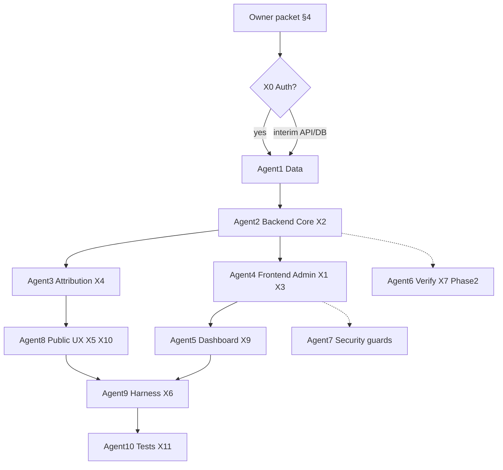

# x402 레퍼럴 Attribution 활성화 스펙

> Related: [[../../X402_REFERRAL_SPEC]] | [[2026-07-03-production-auth-connect-layout-audit-spec]] | [[../../X402_OPEN_LISTING_SPEC]] | [[../../SECURITY]] | [[../../OPERATOR_GUIDE]] | [[../../MULTI_AGENT_COORDINATION]] | [[../../../AGENTS.md]]
>
> Date: 2026-07-03  
> Status: Final spec — **blocked on owner input packet (§4)**  
> Scope: x402 카탈로그·레퍼럴 attribution **운영 활성화** — site/tool 설정, Admin UI, 웹 attribution, 신뢰 고지, smoke·테스트. **결제 실행·커스터디·facilitator 프록시 범위 밖**  
> Evidence: 10-zone 서브에이전트 감사(2026-07-03) + `docs/X402_REFERRAL_SPEC.md` + 소스 대조

---

## 0. 세션 요약

OnchainAI의 x402는 이미 **카탈로그 메타데이터**와 **MCP attribution 백엔드(~70% K1)** 가 존재한다. **“활성화”** 는 새 결제 레일이 아니라, 오너가 payout·bps·`x402_builder_code`를 확정하고, 운영 UI·웹 attribution·고지·smoke를 맞춰 **레퍼럴 메타가 에이전트·사용자에게 일관되게 노출·기록**되게 하는 작업이다.

| # | 갭 | 스펙 ID | 심각도 |
|---|-----|---------|--------|
| 1 | Site referral 기본값 API만, Admin UI·runtime fallback 없음 | X1, X2 | P0 |
| 2 | Per-tool referral Admin UI 없음 (`PUT /api/v2/admin/tool-referral` only) | X3 | P0 |
| 3 | `referral_events` — MCP `get_install_guide`만 기록, 웹 경로 무음 | X4 | P0 |
| 4 | 프론트 x402_notice에 검증 문구 없음 (MCP와 불일치) | X5 | P1 |
| 5 | split-deploy smoke에 x402 없음 | X6 | P1 |
| 6 | 402 probe·가격 검증 자동화 없음 | X7 | P2 (Phase 2) |
| 7 | `allow_x402_registration` 저장만, submit 미강제 | X8 | P2 |
| 8 | Auth P0 미완 시 Admin x402 설정 불가 | 선행 | P0 |

**본 문서는 구현 코드를 포함하지 않는다.** 목표 동작, 오너 입력, 수용 기준, 10-agent 슬라이스, 검증만 정의한다.

---

## 1. 제품 목표

1. **오너가 확정한** payout 주소·bps·`x402_builder_code`가 `site_settings`에 저장되고, per-tool null 필드에 **fallback** 적용된다.
2. 운영자가 Next.js Admin에서 **site x402 설정**과 **도구별 referral**을 켜고 검증 플래그를 볼 수 있다.
3. **MCP + 웹** install guide에서 x402 결제 고지·레퍼럴 disclosure·(가능 시) operator-verified 문구가 **동일 정책**으로 노출된다.
4. `referral_enabled = true` 또는 `pricing = 'x402'` 도구에 대해 **install_guide attribution 이벤트**가 MCP·웹 모두에서 기록된다(남용 방지 rate limit 포함).
5. 프로덕션 split-deploy smoke가 x402 MCP install guide·공개 필터를 검사한다.
6. OnchainAI는 **결제·지갑 연결·자금 이동을 하지 않음** — attribution metadata + 로컬 이벤트만.

---

## 2. 비목표

- Facilitator/프록시 게이트웨이, 커스터디, USDC 전송, `referrer`/`split` 등 **문서화되지 않은** 결제 요청 필드
- K2(OnchainAI MCP 자체 402 과금 — **핵심 발견·`compare_tools` 영구 제외**, [Free Tier Guardian](2026-07-04-free-tier-guardian-spec.md)), K3(스폰서 x402) — `X402_OPEN_LISTING_SPEC` §K deferred
- `payment_verified` 등을 `PUBLIC_TOOL_WHERE` / RLS visibility gate에 추가
- Leptos admin 복원
- 자동 CI/리뷰 봇 트리거

---

## 3. 아키텍처 전제 (2026-07-03)

| 계층 | 역할 | x402 관련 |
|------|------|-----------|
| DB | Supabase Postgres | `017_x402_referral.sql`, `018_referral_events_attribution_session.sql` — 서버 기동 시 auto-migrate |
| API | Railway Axum | `PUT /api/v2/admin/settings`, `PUT /api/v2/admin/tool-referral`, `GET /api/v2/admin/referral-stats`, `POST /mcp` |
| Web | Vercel Next.js | `InstallGuidePanel`, `/admin/settings`, `/admin/tools` |
| Env | — | `X402_FACILITATOR_URL` / `X402_PAY_TO_ADDRESS` — **런타임 미사용** (`.env.example` 주석) |

**활성화 스위치 (운영 의미):**

| 레이어 | “켜짐” 조건 |
|--------|-------------|
| 카탈로그 | `type=x402` OR `pricing=x402` OR `x402_price` — 이미 동작 |
| 레퍼럴 | `referral_enabled = true` + payout/bps/builder_code (tool 또는 site fallback) |
| 신뢰 뱃지 | `payment_verified AND x402_endpoint_verified AND price_verified` — **표시만**, 노출 게이트 아님 |

**이미 구현된 백엔드 (건드리지 말 것):**

- MCP `get_install_guide`: `x402_notice`, `referral` 블록, `install_guide` → `referral_events`
- `sanitize_tool_for_public_response`: public API에서 payout/pay-to 주소 제거
- `PUBLIC_TOOL_WHERE`: x402 검증 플래그 미포함

---

## 4. 오너 입력 패킷 (구현 블로커)

구현 착수 전 아래를 **채워 전달**한다. 비어 있으면 해당 슬라이스는 스킵 또는 placeholder 금지.

### 4.1 필수 (P0)

```text
[x402 Owner Input Packet — copy & fill]

── Site defaults ──
1. default_referral_payout_address:
   Chain: [ Base | Ethereum | Other: ___ ]
   Address: 0x...

2. default_referral_bps: ___   (integer 0–10000, e.g. 250 = 2.5%)

3. x402_builder_code: ___
   Registered with upstream (Coinbase/CDP x402 / Bazaar / other): Y | N
   If N, target registration date: ___

4. referral_model (site default for new pilots): attribution | split
   Note: split = business label only; no on-chain enforcement unless provider supports.

── Legal / disclosure ──
5. Referral disclosure (EN, public-facing):
   "..."

6. Referral disclosure (KO, optional):
   "..."

7. About-page paragraph including paid-tool liability boundary: Y | N (draft attached: Y | N)

── Pilot tools (3–5 rows minimum) ──
| slug | referral_enabled | x402_pay_to_address | x402_price (display) | mcp_endpoint (if known) | notes |
|------|------------------|---------------------|----------------------|-------------------------|-------|
|      | true             | 0x...               | e.g. $0.01/call      | https://...             |       |

── Policy toggles ──
8. allow_x402_registration: true | false

9. referral go-live rule:
   [ ] A — Allow referral_enabled with all verification flags false (attribution-only data)
   [ ] B — Require payment_verified AND x402_endpoint_verified AND price_verified before referral_enabled (recommended)

── Admin access ──
10. GitHub handle(s) with production is_admin: @___
    (Blocked until Phase A auth spec complete if login broken.)

── Verification (Phase 1) ──
11. Phase 1 verification mode: manual-only | defer-auto-probe-to-phase-2

12. If manual: who sets the three flags and evidence format (ticket/link): ___
```

### 4.2 권장 (P1)

```text
13. Site default auto-apply: when tool.referral_bps/payout null and referral_enabled, inherit site_settings — Y | N

14. Provider outreach list for split negotiation (Phase 2+): ___

15. Target chains for future multi-chain payout (if not single-chain): ___

16. Dashboard x402 section: show on homepage when count > 0 — Y | N (already API-backed)
```

### 4.3 오너가 줄 필요 **없는** 것

| 항목 | 이유 |
|------|------|
| `X402_FACILITATOR_URL` | 코드에서 읽지 않음 |
| OnchainAI hot wallet private key | 커스터디 없음 — **payout 주소(공개)만** 필요 |
| Facilitator API key | 범위 밖 |
| USDC transfer 권한 | 범위 밖 |

### 4.4 오너 입력 검증 (구현팀)

| 필드 | 검증 |
|------|------|
| `default_referral_bps` | 0–10000 integer |
| payout address | 체인별 형식(EVM `0x` + length); testnet 주소 prod 사용 금지(오너 확인) |
| `x402_builder_code` | ≤100 chars; upstream 등록 여부 문서화 |
| pilot `slug` | prod DB에 존재·`approved` 여부 확인 |
| disclosure | “수수료/attribution” 투명 고지 포함 여부 Security 리뷰 |

---

## 5. 이슈 레지스트리

### Phase X0 — 선행 (Auth P0)

| ID | 항목 | 의존 |
|----|------|------|
| **X0** | Admin GitHub 로그인·세션 | [[2026-07-03-production-auth-connect-layout-audit-spec]] Phase A |

x402 Admin UI는 **X0 완료 후** 또는 DB/API 직접 설정으로 interim 가능(오너 선택).

---

### Phase X1 — Site 설정 & fallback (P0)

| ID | 심각도 | 증상 | 원인 | 수정안 |
|----|--------|------|------|--------|
| **X1** | P0 | Admin이 referral 기본값 편집 불가 | `frontend/app/admin/settings/page.tsx` — 필드 passthrough만, 폼 없음 | Settings에: `allow_x402_registration`, `default_referral_bps`, `default_referral_payout_address`, `x402_builder_code` 입력·저장 |
| **X2** | P0 | Site default가 MCP에 안 나옴 | `referral_metadata_for_tool()` tool 필드만 사용 (`src/server/mcp/install_guide.rs`) | `referral_enabled` 시 null bps/payout/builder_code → `site_settings` fallback; `public_install_guide` disclosure 동기화 |

**Phase X1 수용 기준**

- [ ] Admin settings 저장 후 `GET /api/v2/admin/settings`에 오너 입력값 반영
- [ ] Pilot tool `referral_bps=null`일 때 MCP `get_install_guide.referral.bps` = site default
- [ ] Public settings API에 referral 필드 **미노출** (`sanitize_site_settings_for_public` 유지)

---

### Phase X2 — Per-tool referral Admin (P0)

| ID | 심각도 | 증상 | 원인 | 수정안 |
|----|--------|------|------|--------|
| **X3** | P0 | 도구별 referral 켜기 UI 없음 | `PUT /api/v2/admin/tool-referral` only; `frontend/lib/api.ts` client 없음 | `updateToolReferral()` + `/admin/tools` workbench 패널: enabled, bps, model, pay-to, builder_code, 3 verification toggles |

**Phase X2 수용 기준**

- [ ] 오너 파일럿 slug 1개 이상 `referral_enabled=true` Admin UI로 저장
- [ ] 비관리자 `PUT /api/v2/admin/tool-referral` → 401/403
- [ ] X0 go-live rule B 선택 시: 3 flags false면 `referral_enabled` 저장 거부 또는 경고

---

### Phase X3 — Attribution & 고지 parity (P0/P1)

| ID | 심각도 | 증상 | 원인 | 수정안 |
|----|--------|------|------|--------|
| **X4** | P0 | 웹 install guide attribution 없음 | `record_referral_event` MCP only | 공통 모듈 추출; 웹 `POST /api/v2/tools/{slug}/attribution` (또는 동등) `event_type=install_guide`, `source=web_install_guide`; rate limit |
| **X5** | P1 | 검증 문구 웹 누락 | `frontend/lib/install-guide.ts` vs `install_guide.rs` | 3 flags 모두 true → “Payment details are operator verified.” else “not operator verified yet.” |
| **X5b** | P1 | Preview에서 고지 숨김 | `.preview-install-wrap .install-guide-meta { display:none }` | preview에서 x402/referral meta 표시 (auth spec D2와 정렬) |

**Phase X3 수용 기준**

- [ ] MCP + 웹 install guide 각 1회 호출 후 `referral_events` 2행(또는 dedup 정책 문서화)
- [ ] 웹·MCP notice 문구 정책 일치(검증 분기 포함)
- [ ] `attribution_session` 또는 동등 식별자 기록(익명 해시)

---

### Phase X4 — Dashboard & Public UX (P1)

| ID | 심각도 | 항목 | 수정안 |
|----|--------|------|--------|
| **X9** | P1 | Referral stats UI 없음 | `/admin` 또는 settings 하위: `GET /api/v2/admin/referral-stats` 카드 |
| **X9b** | P2 | Homepage x402 rail | `metrics.x402_tools` / dashboard API 연동(오너 16번) |
| **X10** | P1 | Tool detail price 미표시 | `x402_price`, `pricing=x402` 한 줄 표시 + verification badges (read-only) |

---

### Phase X5 — Harness & Tests (P1)

| ID | 심각도 | 항목 | 수정안 |
|----|--------|------|--------|
| **X6** | P1 | Prod smoke x402 gap | `smoke-test-api.sh`: MCP `get_install_guide` on known x402 slug; `smoke-test-frontend.sh`: `/tools?pricing=x402` |
| **X11** | P1 | Attribution untested | `tests/x402_referral_flow.rs` (DB): event insert, redaction, unverified still public |
| **X11b** | P1 | Admin referral round-trip test | `validate_tool_referral_payload` + API integration |

---

### Phase X6 — Verification automation (P2, post-traffic)

| ID | 심각도 | 항목 | 수정안 |
|----|--------|------|--------|
| **X7** | P2 | 402 probe 없음 | `src/x402_verification.rs` + `scheduler.rs` cron; flags 자동 갱신 |
| **X8** | P2 | `allow_x402_registration` 미강제 | `submit_tool`에서 settings 읽어 `tool_type=x402` 거부 |
| **X12** | P2 | `view`/`click_out` events | beacon + per-session dedup |
| **X13** | P2 | `reported_settlement` ingest | operator manual 또는 provider webhook (스펙 별도) |

---

## 6. 필수 사용자·에이전트 동작

### 6.1 에이전트(MCP) 경로

1. Agent `POST /mcp` → `get_install_guide { slug, platform }`.
2. 응답: `x402_notice`, `referral { enabled, bps, model, builder_code, payout_address, ... }`.
3. 서버: `referral_events` INSERT `event_type=install_guide` (x402 또는 referral_enabled).
4. Agent는 **오프플랫폼**에서 provider x402 결제 처리 — OnchainAI는 metadata만.

### 6.2 웹 사용자 경로

1. `/tools/{slug}` → Safe install → install guide 렌더.
2. x402_notice + referral_disclosure + verification 문구 표시.
3. (X4) 서버 attribution 기록 — 페이지 이탈 없음.

### 6.3 운영자 경로

1. `/admin/settings` — site defaults (§4.1).
2. `/admin/tools` — per-tool referral (§4.1 pilot table).
3. (선택) verification flags 수동 설정 + evidence 링크(외부).

### 6.4 금지

- 결제 실행, 지갑 connect for payment, facilitator proxy
- 문서화되지 않은 `referrer`/`split` 결제 필드 invent
- 검증 플래그를 public listing gate에 추가

---

## 7. 10-agent 구현 슬라이스 (DAG)



| Agent | 역할 | 소유 경로 | 슬라이스 |
|-------|------|-----------|----------|
| **1** | Data & Schema | `migrations/`, `seeds/` | migration 확인, pilot seed( dev only ), `sqlx prepare` |
| **2** | Backend Core | `src/server/mcp/install_guide.rs`, `src/public_install_guide.rs`, `src/models/` | X2 site fallback |
| **3** | Attribution | `src/server/mcp/`, `src/server/api_v2/` | X4 web attribution API, dedup, rate limit |
| **4** | Frontend Admin | `frontend/app/admin/`, `frontend/lib/api.ts` | X1, X3 |
| **5** | Admin Dashboard | `frontend/app/admin/` | X9 stats UI |
| **6** | Verification Worker | `src/x402_verification.rs`, `src/crawler/scheduler.rs` | X7 (Phase 2) |
| **7** | Security & Trust | `docs/SECURITY.md`, admin guards | go-live rule B, disclosure review |
| **8** | Public UX | `frontend/components/tools/`, `frontend/lib/install-guide.ts` | X5, X5b, X10 |
| **9** | Harness & Deploy | `scripts/smoke-test-*.sh` | X6 |
| **10** | Test & QA | `tests/`, `function_tests.rs` | X11 |

**병렬 규칙:** Agent 2 완료 → 3·4 병렬. Agent 4·3 → 8. 한 파일 동시 2 writer 금지. Coordinator: handoff packet + `agent-harness-check.sh`.

| Slice | 담당 파일(주) | 산출물 |
|-------|---------------|--------|
| **X1** | `frontend/app/admin/settings/page.tsx` | x402 site form |
| **X2** | `install_guide.rs`, `public_install_guide.rs` | site default fallback |
| **X3** | `frontend/app/admin/tools/*`, `api.ts` | tool-referral panel |
| **X4** | new attribution route + shared module | web events |
| **X5** | `install-guide.ts`, `InstallGuidePanel.tsx` | notice parity |
| **X6** | `smoke-test-api.sh`, `smoke-test-frontend.sh` | prod x402 asserts |
| **X7+** | Phase 2 backlog | auto verify, submit gate |

---

## 8. 검증 매트릭스

| Gate | Phase X1–X3 | Phase X4–X5 | Phase X6 |
|------|-------------|-------------|----------|
| `cargo test --features ssr` | X2, X4 터치 시 | — | X7 |
| `cargo clippy` + `fmt --check` | Rust 터치 시 | — | ✓ |
| `cd frontend && npm run lint && npm run build` | admin + install UI | dashboard | — |
| `sqlx prepare` | schema 터치 시 | — | — |
| `ONCHAINAI_REQUIRE_DB_TESTS=1 cargo test` | X11 | — | X7 |
| `./scripts/smoke-test-api.sh` | X6 | ✓ | ✓ |
| `./scripts/smoke-test-frontend.sh` | X6 | ✓ | ✓ |
| `./scripts/ui-change-gate.sh` | `frontend/` 터치 시 | ✓ | — |
| `./scripts/post-deploy-verify.sh` | deploy 후 | ✓ | ✓ |

**수동 (1280 + 375):** pilot tool detail — x402 notice, referral disclosure, (X10) price/badge.

---

## 9. 운영자 체크리스트 (비밀 출력 금지)

```bash
# 1) Schema (prod DB — service role)
# SELECT version FROM _sqlx_migrations WHERE description LIKE '%x402%';

# 2) Site settings (admin cookie)
curl -s 'https://www.onchain-ai.xyz/api/v2/admin/settings' -H 'Cookie: ...' | jq '.default_referral_bps,.x402_builder_code'

# 3) Public settings must NOT leak referral fields
curl -s 'https://www.onchain-ai.xyz/api/v2/settings' | jq 'keys'

# 4) MCP install guide (replace SLUG)
curl -s -X POST 'https://www.onchain-ai.xyz/mcp' \
  -H 'Content-Type: application/json' \
  -d '{"jsonrpc":"2.0","id":1,"method":"tools/call","params":{"name":"get_install_guide","arguments":{"slug":"SLUG","platform":"generic"}}}'

# 5) Split smoke
./scripts/smoke-test-api.sh https://onchainai-production.up.railway.app
./scripts/smoke-test-frontend.sh https://www.onchain-ai.xyz
```

**Go-live 전 (오너):**

- [ ] §4.1 패킷 제출·검증 완료
- [ ] Pilot tools `approved` + public listing 확인
- [ ] Disclosure live on About + install guide
- [ ] go-live rule A or B 문서화
- [ ] `referral_enabled=true` 이면 payout 주소 오타 없음 (on-chain spot check)

---

## 10. 보안·신뢰 경계

| 주제 | 정책 |
|------|------|
| Visibility | `PUBLIC_TOOL_WHERE` — 검증 플래그 **미포함** |
| Public API | `referral_payout_address`, `x402_pay_to_address` strip |
| MCP install guide | `referral.payout_address` 노출 허용(디렉토리 지갑, spec §3) |
| `referral_model=split` | 메타 라벨; 자동 split 보장 아님 — 고지 필수 |
| PostgREST | anon key로 published row **컬럼 전체** 읽기 가능 — server sanitize와 별개; Phase 2에서 view/REVOKE 검토 |
| Attribution abuse | MCP 100/min/IP만; X4에서 attribution 전용 limit 추가 |

---

## 11. 선행·관련 스펙

| 문서 | 관계 |
|------|------|
| `docs/X402_REFERRAL_SPEC.md` | 도메인 원칙·데이터 모델 — **본 스펙이 활성화 실행 계획** |
| `2026-07-03-production-auth-connect-layout-audit-spec` | X0 Admin 로그인 선행 |
| `X402_OPEN_LISTING_SPEC` §K | K2/K3 deferred; K1 attribution 본 스펙 |
| `OPERATOR_GUIDE.md` | Leptos settings 설명 — X1 후 Next.js와 동기화 필요 |

---

## 12. 오픈 질문 (오너 — §4 미포함 시 기본값)

| # | 질문 | 기본 권장 |
|---|------|-----------|
| 1 | go-live rule A vs B | **B** — verification 후 referral_enabled |
| 2 | Phase 1 verification | **manual-only** |
| 3 | Site default auto-apply (X2) | **Y** |
| 4 | Web attribution dedup | 1 `install_guide` / tool / session / hour |
| 5 | Interim config without Auth X0 | DB `UPDATE site_settings` + curl `tool-referral` — UI는 X0 후 |

---

## 13. 완료 정의 (Definition of Done)

**MVP 활성화 완료** = §4.1 오너 패킷 반영 + Phase X1–X3 수용 기준 전부 + X6 smoke + X11 P0 tests + §9 go-live 체크리스트 + `post-deploy-verify.sh` PASS.

**Phase X6 (자동 검증·submit gate)** 는 별도 PR — MVP 완료의 필수 조건 아님.

**수익 발생**은 upstream provider/facilitator 협조 및 split 협상에 의존 — 본 스펙 DoD는 **기술·운영 활성화**만 포함.