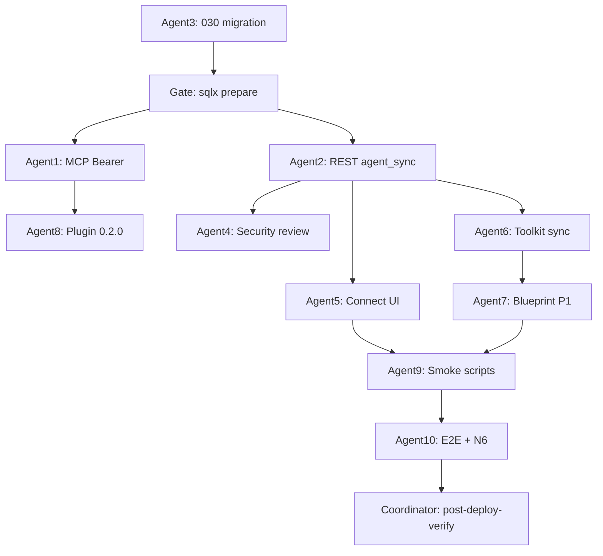

# Agent Sync — Coding Tool → Toolkit & Blueprint 스펙

> Related: [[../../UI_UX_IMPROVEMENT_SPEC]] Phase 7 (Stack Blueprint) | [[2026-06-28-public-dashboard-and-my-toolkit-design]] | [[../../SKILL_PLUGIN_SPEC]] | [[../../CONNECT]] | [[../../SECURITY]] | [[../../MULTI_AGENT_COORDINATION]] | [[../../../AGENTS.md]]
>
> Date: 2026-07-04  
> Status: **Final spec (10-zone audit)** — 구현 전 오너 OD 결정 권장  
> Scope: 코딩 툴(Claude Code, Cursor, Codex, Grok 등)에서 OnchainAI MCP/플러그인으로 다룬 툴이 **웹 툴킷·블루프린트에 자동 반영**되게 하는 계정 연결 + 동기화  
> Evidence: 10 서브에이전트 핸드오프(2026-07-04) + 소스 대조

**본 문서는 구현 코드를 포함하지 않는다.** 목표 동작, API/스키마 계약, 10-agent 슬라이스, 수용 기준, 검증만 정의한다.

---

## 0. 세션 요약

OnchainAI는 이미 **My Toolkit**(`bookmarks` + note/tags)과 **Stack Blueprint**(Phase 7)를 갖췄지만, **MCP `POST /mcp`는 비로그인·읽기 전용**이다. 코딩 툴 세션과 웹 로그인 세션은 연결되지 않아, 에이전트가 `get_install_guide`까지 해도 `/toolkit`에 나타나지 않는다.

**Agent Sync**는 이 간극을 메운다:

1. 웹에서 **Agent token** 발급 (한 번 표시, 이후 prefix만)
2. 코딩 툴 MCP에 `Authorization: Bearer …` 또는 `ONCHAINAI_AGENT_TOKEN` env
3. 인증된 MCP/REST로 **툴킷 저장** (P0) → 선택적으로 **블루프린트 노드 추가** (P1)

| # | 갭 | 스펙 ID | 심각도 |
|---|-----|---------|--------|
| 1 | MCP 무인증, toolkit/blueprint 쓰기 없음 | AS1 | P0 |
| 2 | Agent token / Bearer 경로 없음 | AS2 | P0 |
| 3 | 북마크 `source` 출처 없음 | AS3 | P0 |
| 4 | `/connect` 계정 연결 UI 없음 | AS4 | P0 |
| 5 | 플러그인 0.1.0 read-only, `save_to_toolkit` 없음 | AS5 | P1 |
| 6 | 블루프린트 자동 append + LWW 경쟁 | AS6 | P1 |
| 7 | N6 `toolkit_save`에 `source=agent` 없음 | AS7 | P1 |

---

## 1. 제품 목표

1. 로그인 유저가 **한 번 토큰을 연결**하면, 코딩 툴에서 **명시적으로 저장한** 툴이 웹 `/toolkit`에 즉시 보인다.
2. 툴킷 항목에 **`From agent`** 출처가 표시된다 (`source=agent`, `source_client`).
3. (P1) 동일 토큰으로 **에이전트 세션 블루프린트**에 툴 노드가 자동 추가된다 — Blueprint 팔레트 **My Toolkit** 탭과 연동.
4. (P2) `plugin/onchainai` **0.2.0** — `/find-tool`·skill이 `save_to_toolkit` 플로우를 안내한다.
5. **읽기 전용 MCP**는 토큰 없이도 유지 (`search_tools`, `get_install_guide` 등).
6. OnchainAI는 **결제·지갑·커스터디를 하지 않음** — 북마크/캔버스 메타데이터만.

---

## 2. 비목표

- OAuth per vendor (Cursor/Anthropic 별도) — OnchainAI PAT만
- `search_tools` / `get_tool_detail` **조회만으로** 자동 저장 (노이즈)
- `critical` install_risk 툴 에이전트 경로 저장
- 팀/공유 툴킷, 멀티유저 블루프린트 협업
- 에이전트가 사용자 블루프린트 **삭제·전면 덮어쓰기**
- Bearer 토큰으로 **웹 UI 쿠키 대체** (브라우저는 쿠키만)
- 커밋된 `.mcp.json` / 플러그인 번들에 **실토큰** 포함
- x402 결제 실행, `referrer`/`split` 미문서 필드
- WebSocket 실시간 동기화 (P0–P2; P2+ 폴링만)

---

## 3. 아키텍처 전제

| 계층 | 역할 | Agent Sync |
|------|------|------------|
| DB | `bookmarks`, `blueprints`, 신규 `agent_tokens`, `agent_sync_log` | `030_agent_sync.sql` |
| API | Railway Axum | `POST /api/v2/agent/tokens`, `POST /api/v2/agent/sync/*`, MCP Bearer |
| Web | Vercel Next.js | `/connect#agent-sync`, `/toolkit` 상태 카드 |
| MCP | `POST /mcp` | 기존 5툴 공개 + 인증 시 `save_to_toolkit`, (P1) `save_stack_to_blueprint` |
| Plugin | `plugin/onchainai@0.2.0` | skill/find-tool + `${ONCHAINAI_AGENT_TOKEN}` 헤더 패턴 |

**인증 이중 경로:**

| 클라이언트 | 인증 |
|----------|------|
| 브라우저 `/api/v2/*` | HttpOnly 쿠키 `onchainai_access_token` (기존) |
| 코딩 툴 MCP/REST | `Authorization: Bearer oai_ag_…` |

---

## 4. 오너 결정 (기본값 — §11 로그)

| # | 결정 | **채택 기본값** |
|---|------|-----------------|
| OD-1 | 자동 저장 트리거 | **명시적만:** MCP `save_to_toolkit` 또는 유저 “add to toolkit” — `get_install_guide` 훅은 **opt-in** (`auto_save_on_install_guide: false` 기본) |
| OD-2 | 블루프린트 대상 | **Agent session draft:** `Agent session · {YYYY-MM-DD}` — 당일 재사용, 사용자 지정 보드 덮어쓰기 금지 |
| OD-3 | 블루프린트 배치 | 서버 `nextAgentToolNodeCoords`: 마지막 툴 노드 아래 8px 스냅 스택 |
| OD-4 | 토큰 보관 | `ONCHAINAI_AGENT_TOKEN` env; 헤더 `Authorization: Bearer ${ONCHAINAI_AGENT_TOKEN}` |
| OD-5 | 토큰 TTL | 90일, 유저당 활성 **5개**, revoke 즉시 무효 |
| OD-6 | 툴킷 중복 | 북마크 dedupe; blueprint slug 중복 append **스킵** (에이전트만) |
| OD-7 | 비로그인 에이전트 | 동기화 없음; 로컬 blueprint draft 유지 |

---

## 5. 데이터 모델 (`migrations/030_agent_sync.sql`)

### 5.1 `agent_tokens`

```text
id, user_id → profiles(id) CASCADE
label, client CHECK (cursor|claude-code|windsurf|generic)
token_prefix, token_hash UNIQUE (never plaintext)
scopes TEXT[] DEFAULT '{toolkit:write,blueprint:write}'
default_blueprint_id UUID NULL → blueprints SET NULL
expires_at, last_used_at, revoked_at, created_at
```

- RLS: self CRUD (`auth.uid() = user_id`); hash는 클라이언트 SELECT 제외
- 발급 시 plaintext **1회** 반환: `oai_ag_<opaque>`

### 5.2 `bookmarks` 확장

```text
source TEXT NOT NULL DEFAULT 'web'  CHECK (web|agent|import)
source_client TEXT NULL             CHECK (cursor|claude-code|windsurf|mcp|generic)
```

- 에이전트 upsert: `web→agent` 승격만; 사용자 note/tags **덮어쓰지 않음**
- 빈 note에만 `"Used via agent on {date}"` (선택)

### 5.3 `agent_sync_log`

```text
user_id, agent_token_id, action, tool_slug, blueprint_id
idempotency_key, status, detail JSONB, created_at
UNIQUE (user_id, idempotency_key)
```

- RLS: owner SELECT only; INSERT는 서버

### 5.4 `blueprints`

스키마 변경 없음 (P1). 노드 append는 기존 `nodes` JSONB.

---

## 6. API 계약

### 6.1 토큰 관리 (쿠키 세션)

| Method | Path | Body / Response |
|--------|------|-----------------|
| `POST` | `/api/v2/agent/tokens` | `{ label, client?, expires_in_days? }` → `{ id, token, token_prefix, expires_at }` **once** |
| `GET` | `/api/v2/agent/tokens` | `{ items: [{ id, label, token_prefix, last_used_at, expires_at, revoked_at }] }` |
| `DELETE` | `/api/v2/agent/tokens/{id}` | `204` |

### 6.2 에이전트 동기화 (Bearer)

| Method | Path | Body |
|--------|------|------|
| `POST` | `/api/v2/agent/sync/tool` | `{ slug, note?, tags?, source_client?, idempotency_key? }` |
| `POST` | `/api/v2/agent/sync/blueprint-node` | `{ blueprint_id?, slug, chains?, idempotency_key? }` — P1 |

**`sync/tool` 응답:**

```json
{
  "ok": true,
  "slug": "foo",
  "bookmarked": true,
  "created": false,
  "source": "agent",
  "updated_at": "ISO8601"
}
```

### 6.3 MCP (기존 `POST /mcp`)

**공개 (Bearer 없음):** `search_tools`, `get_tool_detail`, `list_categories`, `get_dashboard_snapshot`, `get_install_guide`

**인증 필요:**

| Tool | Args | 동작 |
|------|------|------|
| `save_to_toolkit` | `slug`, `note?`, `tags?` | → `sync/tool` |
| `save_stack_to_blueprint` | `slugs[]`, `title?` | P1 — 당일 agent session blueprint |
| `link_status` | — | `{ linked: true, user_id_prefix }` |

무인증 호출 시 JSON-RPC `code: "link_required"`, `link_url: "https://www.onchain-ai.xyz/connect#agent-sync"`

### 6.4 Rate limits

| Action | Limit |
|--------|-------|
| Token mint | 5/hour/user |
| `sync/tool` | 60/min/user (bookmark 버킷 공유) |
| `sync/blueprint-node` | 30/min/user |
| Invalid Bearer | IP만 소모, generic 401 |

---

## 7. 프론트엔드 (AS4)

### 7.1 `/connect#agent-sync` — `AgentLinkSection`

- 비로그인: Sign in CTA (`return_to=/connect#agent-sync`)
- 로그인: Generate link token (섹션 유일 오렌지), copy blocks (Claude / Cursor tabs)
- 상태: pending → linked (`aria-live`)
- `data-testid`: `agent-link-section`, `agent-link-generate`, `agent-link-status-linked`, …

### 7.2 `/toolkit`

- 헤더 **Agent sync** 카드: Linked / Not linked
- `ToolCard` 또는 행에 **From agent** 배지 (`source === 'agent'`)
- 필터: All / From agent (P1)

### 7.3 `TopNav` 프로필

- `profile-menu-link-agent` → `/connect#agent-sync`

---

## 8. 플러그인 (AS5, P2)

| 항목 | 변경 |
|------|------|
| `plugin.json` | `0.1.0` → **`0.2.0`** |
| `.mcp.json` | `"headers": { "Authorization": "Bearer ${ONCHAINAI_AGENT_TOKEN:-}" }` |
| `find-tool.md` | install guide 후 `save_to_toolkit` + link_required 안내 |
| `SKILL.md` | Agent Sync 섹션; 명시적 유저 동의 후만 저장 |

Stdio `mcp-remote`는 헤더 미전달 가능 — **HTTP transport 권장**, CONNECT.md에 명시.

---

## 9. 10-Agent 구현 슬라이스

| Zone | Agent | 담당 | 산출물 | 선행 |
|------|-------|------|--------|------|
| 1 | **MCP Auth** | `resolve_mcp_bearer`, 조건부 `tools/list` | `src/server/mcp/auth.rs` | 030 |
| 2 | **API Contract** | `agent_sync.rs`, token CRUD | REST + handoff | 030 |
| 3 | **Data & Schema** | `030_agent_sync.sql`, RLS | migrate + `sqlx prepare` | — |
| 4 | **Security** | threat model, scope, audit | S1–S16 체크리스트 | 2 |
| 5 | **Frontend Connect** | `AgentLinkSection`, connect/toolkit UI | `frontend/components/connect/` | 2 frozen |
| 6 | **Toolkit Auto-save** | upsert, source, dedup, badge | bookmark + toolkit API/UI | 2,3 |
| 7 | **Blueprint Sync** | append-node, placement, session title | P1 endpoint + editor | 6 |
| 8 | **Plugin & Skill** | 0.2.0, find-tool, SKILL | `plugin/onchainai/` | 1,2 |
| 9 | **Harness & Smoke** | `smoke-test-api.sh`, frontend needles | `test-smoke-test.sh` | 4,5 |
| 10 | **Product & N6** | metrics, OD log, acceptance | Vercel WA events | 6 |

### DAG



---

## 10. 단계별 롤아웃

### P0 — Token + Toolkit (2–3주 목표)

- [ ] `030_agent_sync.sql`
- [ ] Token mint/revoke/list
- [ ] `POST /api/v2/agent/sync/tool` + MCP `save_to_toolkit`
- [ ] `/connect#agent-sync` UI
- [ ] Toolkit **From agent** 배지
- [ ] N6: `toolkit_save` + `source`, `client`; `agent_token_created`

**P0 exit:** Bearer로 slug 저장 → `/toolkit` 새로고침 후 5초 이내 표시.

### P1 — Blueprint sync

- [ ] `POST /api/v2/agent/sync/blueprint-node` 또는 atomic append
- [ ] `Agent session · {date}` blueprint 자동 생성/재사용
- [ ] `initialToolNodeChains` on auto-add
- [ ] N6: `blueprint_create` + `source=agent`

### P2 — Plugin polish

- [ ] Plugin 0.2.0 marketplace
- [ ] CONNECT.md Agent Sync 절
- [ ] Toolkit 필터, optional 30s poll on focus

---

## 11. 수용 기준

### P0 — Toolkit

- [ ] 토큰 발급 → plaintext 1회; 목록은 prefix만
- [ ] Revoke → 다음 Bearer 요청 401
- [ ] `save_to_toolkit` 성공 → `GET /api/v2/toolkit`에 slug 포함
- [ ] 재저장 → 북마크 유지, `updated_at` 갱신, note 사용자 작성분 보존
- [ ] 무토큰 `save_to_toolkit` → `link_required`
- [ ] `critical` risk → 400 거부
- [ ] 추적 `.mcp.json`에 `oai_ag_` 리터럴 0건

### P1 — Blueprint

- [ ] 첫 sync 당일 `Agent session · {date}` 생성
- [ ] 동일 slug 이미 캔버스에 있으면 skip
- [ ] 120 nodes 초과 시 toolkit은 성공, blueprint `node_limit` 스킵 응답
- [ ] 모바일 375px 읽기 전용에서 노드 표시

### P2 — Plugin E2E

- [ ] `/plugin install` → link → `/find-tool` → save → toolkit ≤5s

---

## 12. 검증 (§9 DoD)

```bash
sqlx migrate run
cargo sqlx prepare -- --features ssr
cargo test --features ssr
cargo clippy --features ssr -- -W clippy::all && cargo fmt --check
cd frontend && npm run lint && npm run build
./scripts/test-smoke-test.sh
./scripts/smoke-test-api.sh      # after contract land
./scripts/smoke-test-frontend.sh
./scripts/agent-harness-check.sh
# UI touched:
./scripts/ui-change-gate.sh
```

푸시: `[skip ci]`. 프로덕션 병합 후 `./scripts/post-deploy-verify.sh`.

### Smoke needles (Agent 9)

- API: `/api/v2/agent/tokens`, `save_to_toolkit`, `ONCHAINAI_SMOKE_AGENT_TOKEN` (optional local)
- Frontend: `data-testid="agent-link-section"`

---

## 13. 성공 지표 (Agent 10 / N6)

| Metric | Target (90d post-P0) |
|--------|----------------------|
| `toolkit_save` where `source=agent` | ≥15% of toolkit saves (among linked users) |
| PAT adoption | ≥10% MAU with toolkit ≥1 item |
| Agent → blueprint link rate (7d) | ≥25% agent toolkit items on a blueprint |
| Sync failure rate | <2% |

---

## 14. 10-Zone 감사 로그

| Zone | Agent | Key finding |
|------|-------|-------------|
| 1 MCP | Auth bridge | Cookie-only today; Bearer on same `POST /mcp` 권장 |
| 2 API | Contract | Additive REST; bookmarks/blueprints 재사용 |
| 3 Data | Schema | `030_agent_sync.sql`; bookmark UPDATE RLS gap fix |
| 4 Security | Trust | Hash+prefix; scopes; no token in repo |
| 5 Frontend | Connect UX | `/connect#agent-sync` canonical |
| 6 Toolkit | Auto-save | Explicit save only; source=agent |
| 7 Blueprint | Sync | P1; session draft; atomic append 필요 |
| 8 Plugin | Skill | 0.2.0; `${ONCHAINAI_AGENT_TOKEN}` |
| 9 Harness | Smoke | Contract frozen 후 script PR |
| 10 Product | Framing | P0 toolkit → P1 blueprint → P2 plugin |

---

## 15. 관련 문서 갱신 (구현 PR과 동일)

- `docs/CONNECT.md` — Agent Sync 절 + HTTP-only sync
- `docs/SKILL_PLUGIN_SPEC.md` — §Agent Sync
- `docs/SECURITY.md` — agent token 1줄
- `UI_UX_IMPROVEMENT_SPEC` §N6 — `source`/`client` 확장

---

## 완료 조건

- P0 전 항목 §11 수용 기준 통과 + smoke 증거
- Coordinator `post-deploy-verify` green
- 오너 OD-1~7 확정 또는 기본값 채택 로그