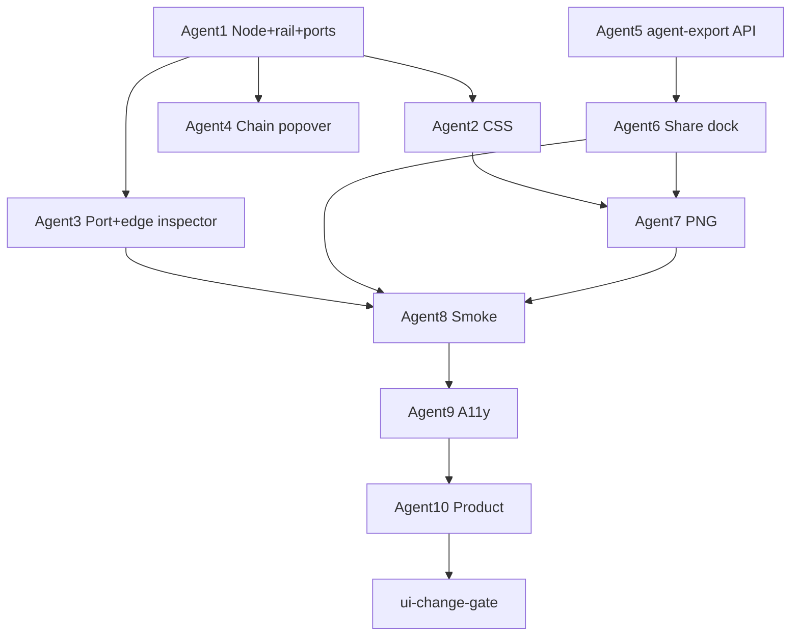

# Stack Blueprint v2 — 노드 크롬·연결 UX·에이전트 Share Dock 최종 스펙

> Related: [[../../UI_UX_IMPROVEMENT_SPEC]] §Phase 7 | [[2026-07-03-visual-ui-audit-16-agent-spec]] | [[../../../DESIGN]] | [[../../MULTI_AGENT_COORDINATION]] | [[../../../AGENTS.md]]
>
> Date: 2026-07-04 (v1.2 — Share dock·프롬프트 편집·레이아웃 안정성)  
> Status: **Final spec — 오너 리뷰 후 구현**  
> Scope: 블루프린트 에디터 UX(노드 잘림·**글자/카드 밀림 방지**·외부 레일·포트 연결) + **우하단 Share dock**  
> Evidence: 오너 스크린샷 2장 + `grok/ui-audit-p0p1` 소스 대조 + 대화 합의(2026-07-04)

**본 문서는 구현 코드를 포함하지 않는다.** 목표 동작, 레이아웃 계약, 모순 해소, 10-agent 슬라이스, 수용 기준만 정의한다.

---

## 0. 세션 요약

### 0.1 오너가 본 문제 (스크린샷)

| # | 증상 | 원인(소스) |
|---|------|------------|
| V1 | 툴 카드 제목 중간 잘림 (`Uniswap Trader M...`) | 고정 `width: 220px`, 카드 **내부**에 링크·배지·체인 UI가 공간 경쟁 |
| V2 | MCP/SDK/CLI 태그가 큼 | 일반 `Badge` 컴포넌트 그대로 사용 |
| V3 | 체인 스티커 로고 중간 잘림, 뒤 타원형 배경 | `.blueprint-node-chain` `border-radius: 999px` + 비정사각 padding; 삭제 X가 로고 위 겹침 |
| V4 | 삭제 버튼 누르기 어려움 | 24px·hover-only·카드 내부; 선택 시 체인 피커 자동 확장 |
| V5 | 선 연결 불편 | Connect 모드 2클릭; 연결 후 수정 어려움 |
| V6 | 에이전트가 블루프린트 이해 못 함 | 읽기 MCP 없음 → **이미지 + 편집 가능 프롬프트** 수동 전달 |
| V7 | 자동 프롬프트가 의도와 다를 수 있음 | 생성본 검토·**수정** 단계 없음 |
| V8 | 글자·태그·체인 UI가 서로 밀어냄 | 가변 높이·absolute overlay·flex `min-width` 미설정 |
| V9 | 선택/호버 시 카드 크기·위치가 변함 | 체인 피커·레일·인스펙터가 **문서 flow**에 참여 |
| V10 | 노드·선·라벨 겹쳐 가독성 저하 | z-index·앵커·클립 규칙 부재 |

### 0.2 기능적 중요도 (에이전트 신호)

| 데이터 | 에이전트 신호 | MCP 오늘 |
|--------|---------------|----------|
| 툴 `slug` | **높음** | `save_stack_to_blueprint` **쓰기만** (ui-audit 브랜치) |
| `note` 텍스트 | **높음** | 읽기 없음 |
| `chains` (툴 노드) | 중간 | append 시 선택적 |
| `edges` | 중간(흐름) | **미해석** — export `## Flow`로만 전달 |
| `x`,`y` | 낮음 | export·MCP 모두 무시 |

### 0.3 베이스 브랜치

구현 시작점: **`grok/ui-audit-p0p1`** (`edges`, chain 노드, `BlueprintConnectToolbar` 등).  
`main`에는 edges 없음 — **분기 필수**.

```bash
git fetch --all
git checkout -b grok/blueprint-v2-ux origin/grok/ui-audit-p0p1
git status --short
```

### 0.4 모순 해소 로그 (v1.0 → v1.1)

구현 전 아래 결정을 **단일 정본**으로 따른다. 이전 대화·v1.0 초안과 충돌 시 **본 절이 우선**.

| # | 이전/충돌 | **v1.1 확정** | 이유 |
|---|-----------|---------------|------|
| C1 | Share를 **툴바**에 둠 (§6.1 v1.0) | Share는 **뷰포트 우하단 고정 dock** (캔버스·모눈종이 좌표 아님) | 팬해도 위치 고정; 툴바 밀도 감소; 챗본式 UX |
| C2 | Copy = 서버 markdown 그대로 | Copy/Download = **사용자가 수정한 textarea 내용** | 의도 보정 필수 (V7) |
| C3 | 툴바 Delete + 레일 Delete 중복 가능 | **Delete primary = 노드 레일**; 툴바 Delete **제거**; 키보드 Delete 유지 | V4 해결·단일 경로 |
| C4 | Connect 툴바 + 포트 드래그 공존 | `BlueprintConnectToolbar`·Connect 모드 **삭제**; edge 스타일은 **선 선택 시에만** 상단 인스펙터 | V5·포인터 충돌 방지 |
| C5 | 모바일 Share 숨김 | `<1024px` **편집** 읽기 전용이지만 **Share dock 표시** (프롬프트·PNG는 허용) | 보기 전용이어도 에이전트 전달 가치 있음 |
| C6 | PNG에 레일/FAB 포함 애매 | PNG 캡처에서 **Share dock·노드 레일 제외** (clean export) | 전달용 이미지 잡음 제거 |
| C7 | 수정 프롬프트 DB 저장 | **DB 저장 안 함**; P0 세션 메모리, P1 `localStorage` per blueprint id | 블루프린트 JSON과 이중 진실 방지 |
| C8 | agent-sync 스펙 파일 링크 | Agent Sync는 **별도 후속**; 본 스펙은 `agent-export` **읽기 API만** 추가 | ui-audit에 sync 있으나 본 PR 범위 밖 |
| C9 | 오렌지 primary | 에디터 내 오렌지 1개 = **Share panel의 Copy prompt**만; dock FAB 본체는 neutral | `DESIGN.md` 화면당 primary 1개 |
| C10 | `overflow: visible` vs 캔버스 클립 | **viewport**는 `overflow:auto` 유지; 노드 **wrap**은 `overflow:visible`; 본체는 `overflow:hidden`으로 **내부 텍스트만** 클립 | 팬 유지 + 카드 내부 정돈 |
| C11 | 레일 표시 시 카드 밀림 | 레일·popover는 **absolute/portal**; 저장 좌표 `x,y`는 **본체만**; wrap은 시각 overflow | DB 좌표 안정 |
| C12 | 헤더 edge 인스펙터로 툴바 점프 | 헤더 `min-height: 52px` **고정**; 인스펙터 슬롯 예약 또는 오버레이 | 글자·버튼 밀림 방지 |

---

## 1. 제품 목표

1. 노드·스티커 **잘림 제거** — 외부 액션 레일 + 정원 체인 스티커.
2. **포트 드래그**로 연결·선택·스타일 변경·삭제.
3. 체인 선택 **명시적** (선택 ≠ 피커 자동 오픈).
4. **Share dock**: 자동 초안 → **사용자 수정** → Copy / Download (PNG·md).
5. 자동저장·한도·기존 `data-testid`·데스크톱 편집 / 모바일 읽기 전용 **유지**.
6. **레이아웃 안정성**: 선택·호버·popover·인스펙터로 카드 크기·위치·글자 배열이 **변하지 않음** (§5.5).

---

## 2. 비목표

- 블루프린트 공유 URL·실시간 협업
- MCP `get_blueprint` (후속 §16 N-B1)
- 프롬프트 수정본 서버 영구 저장
- 완전 자유 곡선·edge waypoints DB (P3)
- x402 결제 UI
- 모바일 **캔버스 편집** 활성화
- Agent Sync 신규 MCP 도구 (기존 sync 유지만; 본 PR에서 확장 안 함)

---

## 3. 오너 결정 (기본값)

| # | 결정 | **채택 기본값** |
|---|------|-----------------|
| OD-1 | 툴 카드 너비 | **260px**; 제목 2줄 clamp |
| OD-2 | 타입 태그 | compact pill, 10px, 높이 ≤16px |
| OD-3 | 노드 액션 | 카드 **밖 오른쪽 레일** 32px |
| OD-4 | 체인 스티커 | **48×48 정원**; 이중 배경 없음 |
| OD-5 | 체인 피커 | 레일 Chains → popover (**선택 시 자동 X**) |
| OD-6 | 연결 | 포트 드래그; Connect 모드 **삭제** |
| OD-7 | Share 위치 | **뷰포트 `fixed` 우하단 dock** (캔버스 스크롤과 무관) |
| OD-8 | Share 플로우 | Generate → **edit textarea** → Copy/Download |
| OD-9 | PNG 범위 | 기본 **뷰포트**; P1 **fit all nodes**; dock·레일 **제외** |
| OD-10 | 수정본 보관 | P0 in-memory; P1 `localStorage` key `onchainai-blueprint-share-draft:{id}` |
| OD-11 | 카드 치수 | 툴 본체 **고정 260×min88px**; 체인 wrap **48×(48+label)** 고정 박스 |
| OD-12 | 텍스트 | 제목 2줄 clamp; 태그·체인 배지 **전용 행**; `min-width:0` on flex text column |
| OD-13 | 상호작용 UI | popover·레일·포트 = **flow 밖**; 상태 변경 시 **reflow 0** |
| OD-14 | z-index | edges(1) &lt; nodes(2) &lt; ports(3) &lt; rail(4) &lt; popover(5) &lt; rubber-band(6) &lt; share-dock(20) |

---

## 4. 에디터 레이아웃 (전체)

```
┌ header: Back | title | [edge inspector when edge selected] | Add note | save state ─┐
├ palette ─┬──────────────────── canvas viewport (scroll/pan) ────────────────────────┤
│          │                                                                          │
│          │                                                         ┌─ share panel ─┐ │
│          │                                                         │ [Prompt][Img]│ │
│          │                                                         │ <textarea>   │ │
│          │                                                         │ Regenerate   │ │
│          │                                                         │ Copy (orange)│ │
│          │                                                         └──────▲───────┘ │
│          │                                                    [ Share ⬡ ]  fixed BR │
└──────────┴──────────────────────────────────────────────────────────────────────────┘
         ↑ viewport bottom-right = browser window corner (NOT canvas 4000px corner)
```

| 영역 | `position` | 비고 |
|------|------------|------|
| Share dock FAB | `fixed; right: 24px; bottom: 24px` | `z-index` 캔버스 위, `LoginModal` 아래 |
| Share panel | FAB **위로** 펼침 (`bottom: calc(24px + fabHeight + 8px)`) | 닫기 ×, Esc |
| Edge inspector | **헤더** reserved slot (C12) | edge 미선택 시 `visibility:hidden` + `pointer-events:none` (**높이 유지**) |
| Header | `min-height: 52px` | 툴바 줄바꿈·인스펙터로 아래 캔버스 밀리지 않음 |

---

## 5. 노드 크롬 (V1~V4)

### 5.1 노드 wrap + 외부 레일

```
  ○──┌────────────────────────────┐──┬───┐
     │ [logo]  Tool name (2 lines)│  │ ↗ │
     │         [mcp] tiny badges  │  │ ⛓ │
     └────────────────────────────┘──│ ✕ │
  port ○                            └───┘
                                    rail (outside)
```

| 규칙 | 값 |
|------|-----|
| `.blueprint-node-wrap` | `position:absolute`; 좌표 = 노드 x,y |
| 드래그 | **본체만** dnd-kit; 레일·포트는 `listeners` 제외 |
| 레일 표시 | hover 또는 selected |
| 툴바 Delete | **제거** (C3) |

### 5.2 툴 노드

- 본체 **260×min88px 고정** (§5.5.1); `ToolLogo` 36px; compact type tag 전용 행
- 체인 배지: row2 한 줄 + `+N`; popover는 레일 ⛓ + **portal**
- 카드 내부 ↗ **제거** → 레일만

### 5.3 체인 스티커

- 48×48 `border-radius:50%`; `ChainLogo` 32px center
- 라벨: 원 **아래** 4px (원 안 금지)
- 삭제: 레일만

### 5.4 메모 노드

- 260px; min-height 88px; 레일 Delete only
- textarea `resize: vertical`; max-height 240px (캔버스 밀림 상한)

### 5.5 레이아웃 안정성·가시성 (V8~V10 — 밀림·잘림 방지)

**원칙:** 인터랙션으로 **본체 박스 크기·저장 좌표(x,y)·글자 줄 수**가 변하면 안 된다. 보조 UI는 overflow·portal로 분리한다.

#### 5.5.1 툴 노드 내부 그리드 (고정 치수)

```
┌─ 260px fixed ─────────────────────────────┐
│ row1 [logo 36px fixed] [text col flex 1]    │  min-height 40px
│      min-width:0 on text col                │
│ row2 [type tag 16px] [chain badges row]     │  height 18px fixed
└─────────────────────────────────────────────┘
```

| 규칙 | CSS/구현 |
|------|----------|
| 본체 너비 | `width:260px` (**max-width 동일**); content로 늘어나지 않음 |
| 본체 높이 | `min-height:88px`; 2줄 제목+태그 행이 항상 들어갈 공간 **예약** |
| 로고 | `flex-shrink:0`; `width/height:36px`; `overflow:visible` |
| 제목 | `-webkit-line-clamp:2`; `overflow:hidden`; **한 줄↔두 줄 전환 시에도** row1 `min-height` 고정 |
| 타입 태그 | 전용 `.blueprint-node-type-tag` 행; `height:16px`; Badge 컴포넌트 **사용 안 함** |
| 체인 배지 | row2 한 줄; `max-height:18px`; `overflow:hidden`; 8개 초과 시 `+N` pill (**줄바꿈 금지**) |
| 본체 overflow | `overflow:hidden` (내부만 clip); wrap은 `overflow:visible` |

#### 5.5.2 wrap·레일·popover (카드 밀림 방지)

| 요소 | 위치 | 밀림 방지 |
|------|------|-----------|
| `.blueprint-node-wrap` | `position:absolute; left:x; top:y` | 저장 `x,y` = **본체 좌상단**만 |
| `.blueprint-node-rail` | `position:absolute; left:100%; margin-left:4px` | 본체 width에 **포함 안 함** |
| 체인 popover | `React portal` → `document.body` 또는 viewport; `position:fixed` | 카드 높이·너비 **불변** |
| 포트 | 본체 좌우 `translateY(-50%)`; `position:absolute` | 포트 표시로 본체 크기 변경 없음 |

레일 표시: `opacity` + `pointer-events` 전환; **`display:none` ↔ block 토글로 레이아웃 재계산 금지** (레일은 absolute라 본체 무관).

#### 5.5.3 체인 스티커 고정 박스

```
     ┌ 48px circle ┐
     │   logo 32   │
     └─────────────┘
        label 11px   ← 항상 1줄 ellipsis, max-width 80px, height 14px reserved
```

| 규칙 | 값 |
|------|-----|
| wrap 총 높이 | `48 + 4 + 14 = 66px` **고정** (라벨 없어도 공간 유지) |
| 원 | `width/height:48px`; `border-radius:50%`; `aspect-ratio:1` |
| 로고 | 32px center; **추가 wrapper 배경 금지** (V3) |
| 라벨 | 원 **밖**; `position:absolute; top:52px`; `white-space:nowrap` |

#### 5.5.4 z-index·겹침 가시성

| 레이어 | z-index | 비고 |
|--------|---------|------|
| `.blueprint-edges-layer` | 1 | 선은 노드 아래 |
| `.blueprint-node-wrap` | 2 | 기본 |
| `.blueprint-node-wrap.is-selected` | 3 | 선택 노드 위로 |
| `.blueprint-node-wrap.is-dragging` | 10 | 드래그 최상위 (캔버스 내) |
| 포트 | 4 (wrap 내) | 선 hit 위 |
| 레일 | 4 | |
| 체인 popover | 5 | |
| 고무줄 프리뷰 SVG | 6 | |
| Share dock | 20 | |
| LoginModal | (기존) | dock보다 위 |

**앵커:** edge는 `getNodeBounds` **본체만** 기준; 레일·라벨·포트는 앵커에 포함 안 함.

**겹침 완화 (P0):** 선택 노드 `z-index` bump; P1 optional collision nudge 알고리즘은 범위 밖.

#### 5.5.5 헤더·캔버스·팔레트

| 영역 | 방지책 |
|------|--------|
| 헤더 | `min-height:52px`; edge 인스펙터 슬롯 **항상 DOM 유지** (`visibility:hidden`) |
| 제목 input | `flex:1; min-width:120px`; 긴 제목은 input 내 scroll, 툴바 줄바꿈 최소화 |
| 팔레트 | `flex-shrink:0; width:280px`; 캔버스 가로 밀림 없음 |
| viewport | `min-width:0` on flex child; 가로 스크롤은 캔버스 surface만 |

#### 5.5.6 PNG·export 가시성

캡처 직전 `data-blueprint-exporting="true"` on viewport:

- `.blueprint-node-rail` → `opacity:0`
- `.blueprint-share-dock` → exclude (기존)
- 선택 outline만 유지 또는 전부 neutral (OD-9: **clean** — selection outline도 제거)

#### 5.5.7 구현 체크리스트 (Agent 1·2)

- [ ] 툴 본체 `width/max-width:260px`, `min-height:88px`
- [ ] 텍스트 컬럼 `min-width:0`
- [ ] 체인 배지 한 줄 + `+N`
- [ ] popover portal (flow 밖)
- [ ] 체인 wrap 66px 고정 박스
- [ ] 헤더 `min-height` + 인스펙터 슬롯
- [ ] z-index 표 준수
- [ ] 선택/호버/피커 오픈 전후 **getBoundingClientRect 본체 width/height 동일** (수동 QA)

---

## 6. 연결 UX (V5)

### 6.1 포트 드래그

| 단계 | 동작 |
|------|------|
| 1 | out-port drag → 고무줄 |
| 2 | in-port 또는 노드 본체 drop → edge 생성 |
| 3 | 빈 캔버스 / Esc → 취소 |

스타일/색 기본값: `localStorage` `onchainai-blueprint-edge-prefs`.

### 6.2 선 선택 · 헤더 인스펙터 (Connect 툴바 대체)

edge 선택 시 **헤더**에만 표시: Solid | Arrow, 색 5종, Delete link.  
미선택 시 DOM에서 제거 또는 `hidden` (툴바 슬롯 점유 최소).

### 6.3 포인터 우선순위

| 타깃 | 동작 |
|------|------|
| Share dock / panel | dock UI (캔버스 팬 **안 함**) |
| 포트 | 연결 |
| 레일 | 액션 |
| 노드 본체 | 이동 |
| 빈 캔버스 | 팬 |
| 선 hit-stroke | 선 선택 |

### 6.4 데이터

`edges`: `{ id, fromId, toId, style, color }` — 백엔드 변경 없음.

---

## 7. Share dock (V6·V7)

### 7.1 컴포넌트

- `BlueprintShareDock.tsx` — `BlueprintEditor` 자식, **canvas viewport 밖** (에디터 root에 portal 또는 sibling).
- **목록 페이지(`/blueprints`)에는 없음.**

### 7.2 FAB (접힘)

| 속성 | 값 |
|------|-----|
| 라벨 | `Share` + lucide `share-2` 또는 `bot` |
| 크기 | min 48×48 또는 pill |
| 스타일 | neutral (`blueprint-share-dock-fab`) |
| `data-testid` | `blueprint-share-dock` |

### 7.3 펼침 패널

**탭 2개:** `Prompt` | `Image`

#### Prompt 탭 (P0)

| UI | 동작 |
|----|------|
| 안내 1줄 | "Auto-generated draft — edit before sending." |
| `<textarea>` | 12–20 rows; 서버/클라이언트 markdown 초안; **자유 편집** |
| `Regenerate` | blueprint 최신 상태로 재생성; **수정 있으면 confirm** |
| `Copy prompt` | **textarea 현재 값** → clipboard (**오렌지 primary**) |
| `Download .md` | textarea → `blueprint-agent.md` (P0 optional, P1 if slip) |

#### Image 탭 (P0)

| UI | 동작 |
|----|------|
| 미리보기 | 마지막 캡처 썸네일 또는 Capture 버튼 |
| `Download PNG` | 뷰포트 캡처 (§7.5) |

#### P1

- fit-all-nodes PNG
- zip bundle (`png` + `md` from textarea)
- `localStorage` 수정본 복원

### 7.4 노출·disabled

| 상태 | dock |
|------|------|
| 노드 0개 | FAB visible; panel "Add tools to generate a prompt" |
| readOnlyLayout `<1024` 편집 불가 | FAB **visible**; prompt/Image **허용** (C5) |
| draft `/blueprints/draft` | 클라이언트 조립 markdown; API 없이 동작 |
| guest | dock hidden (로그인 또는 draft만) |

### 7.5 PNG 캡처

- `html-to-image` (frontend)
- 대상: `.blueprint-canvas-viewport` (뷰포트 가시 영역)
- **제외:** `.blueprint-share-dock`, `.blueprint-node-rail`, edge inspector
- FAB/레일 없는 clean board shot

### 7.6 프롬프트 생성 (서버)

`GET /api/v2/blueprints/{id}/agent-export` — 쿠키, 소유자.

```json
{
  "title": "string",
  "markdown": "string",
  "slugs": ["string"],
  "filename": "blueprint-agent.md"
}
```

섹션: Title, Tools (slug 메타), Notes, Flow (edges 위상정렬), Task (§13 템플릿).  
**응답은 초안일 뿐** — 최종본은 항상 클라이언트 textarea (C2).

드래프트: `getToolBySlug` 병렬 + 로컬 nodes/edges 조립.

### 7.7 `data-testid`

| id | 요소 |
|----|------|
| `blueprint-share-dock` | FAB |
| `blueprint-share-panel` | 펼침 패널 |
| `blueprint-share-prompt-edit` | textarea |
| `blueprint-share-regenerate` | Regenerate |
| `blueprint-copy-prompt` | Copy |
| `blueprint-download-png` | PNG |

---

## 8. API (추가만)

| Method | Path |
|--------|------|
| `GET` | `/api/v2/blueprints/{id}/agent-export` |

CRUD·edges PUT 불변.

---

## 9. 10-Agent 슬라이스

| Zone | Agent | 담당 | 산출물 |
|------|-------|------|--------|
| 1 | Node Chrome | wrap, rail, ports, chain circle | `BlueprintNodeView`, `BlueprintNodeWrap` |
| 2 | CSS & layout | 노드·레일·dock·z-index·고정 치수·§5.5 | `globals.css` blueprint 섹션 |
| 3 | Port & Edge | 포트 드래그, 고무줄, 헤더 edge inspector, Connect **삭제** | `BlueprintEditor`, `BlueprintEdgesLayer` |
| 4 | Chain Picker | popover, 자동 피커 제거 | `BlueprintToolChainMemo` |
| 5 | Export API | `agent-export` + markdown builder | `blueprints.rs` |
| 6 | Share Dock | FAB, panel, textarea, regenerate, copy | `BlueprintShareDock.tsx` |
| 7 | PNG Capture | `blueprint-export.ts`, exclude dock/rail | `frontend/lib/` |
| 8 | Harness | testid, smoke | `scripts/smoke-test-*.sh` |
| 9 | A11y | dock focus trap, Esc, aria-live | 1, 3, 6 |
| 10 | Product | N6, CONNECT 1줄 | docs hook |

### DAG



### 경로 소유

| Agent | globs |
|-------|-------|
| 1,3,4,6 | `frontend/components/blueprint/**` |
| 7 | `frontend/lib/blueprint-export.ts`, `blueprint-share*.ts` |
| 2 | `frontend/app/globals.css` |
| 5 | `src/server/api_v2/blueprints.rs` |
| 8 | `scripts/smoke-test-*.sh` |
| 10 | `docs/CONNECT.md` |

**삭제 대상 (Agent 3):** `BlueprintConnectToolbar.tsx` — edge UI는 헤더 인스펙터로 이전.

---

## 10. 롤아웃

### P0

- [ ] 노드 wrap + 레일 + 정원 체인 + **§5.5 레이아웃 안정성**
- [ ] compact tag, 2줄 제목, 고정 260×min88, 툴바 Delete 제거
- [ ] 헤더 min-height + edge 인스펙터 슬롯 (밀림 없음)
- [ ] 포트 드래그 + 헤더 edge inspector
- [ ] Share dock + editable prompt + Copy
- [ ] 뷰포트 PNG (dock/rail 제외)
- [ ] `agent-export` API

### P1

- [ ] fit-all PNG, zip bundle, Download .md
- [ ] localStorage prompt draft
- [ ] edge 끝점 재연결
- [ ] list 삭제 UI

### P2 (§16)

- [ ] MCP `get_blueprint`
- [ ] 직교 라우팅

---

## 11. 수용 기준

### 노드

- [ ] 제목 2줄; 체인 정원 48px; 타그 ≤16px; 레일 Delete 3클릭 이내
- [ ] 툴바에 Delete 버튼 **없음**

### 레이아웃 안정성 (§5.5)

- [ ] 툴 본체 **260×min88px 고정**; 긴 제목·다체인이어도 **높이·너비 불변**
- [ ] 선택·호버·Chains popover 오픈 전후 본체 `getBoundingClientRect()` **width/height 동일**
- [ ] 체인 스티커 wrap **66px 고정**; 로고·라벨 잘림 없음; 타원 배경 없음
- [ ] 체인 배지 8개 초과 시 `+N` 한 줄; 태그 행이 제목을 **세로로 밀지 않음**
- [ ] edge 인스펙터 토글 시 헤더·캔버스 **세로 점프 없음** (≤2px 허용)
- [ ] 인접 노드 2개 배치 시 본체 겹침 없이 라벨·레일이 읽기 가능 (수동 시각 QA)

### 연결

- [ ] Connect 토글 **없음**; 포트 드래그로 연결
- [ ] edge 선택 시에만 헤더 인스펙터

### Share dock

- [ ] FAB가 캔버스 팬 후에도 **화면 우하단** 고정
- [ ] textarea 수정 후 Copy → clipboard가 **수정본**과 일치
- [ ] Regenerate + confirm이 수정본 덮어씀
- [ ] PNG에 FAB·레일 **미포함**
- [ ] 375px: dock 표시, prompt copy 가능

### 회귀

- [ ] 자동저장 2s; 기존 testid 보존
- [ ] `cargo test` blueprints green

---

## 12. 검증

```bash
cd frontend && npm run lint && npm run build
cargo test --features ssr blueprints
./scripts/ui-change-gate.sh
./scripts/smoke-test-frontend.sh
./scripts/smoke-test-api.sh
```

Smoke: `blueprint-share-dock`, `blueprint-share-prompt-edit`, `blueprint-copy-prompt`, `agent-export` 200.

### 시각 QA 매트릭스 (1280×900, Agent 2·8)

| 시나리오 | Pass 조건 |
|----------|-----------|
| 긴 툴 이름 40자+ | 2줄 clamp; 카드 밖으로 텍스트 안 새음 |
| MCP+3체인 배지 | 한 줄; `+N` 표시; 카드 높이 불변 |
| Chains popover 오픈 | 본체 크기·위치 불변 |
| 노드 선택↔해제 | 레일만 opacity; 본체 안 움직임 |
| Bitcoin 스티커 | 정원·로고 전체 가시 |
| edge 3개 교차 | 선택 노드가 선 위 z-index로 읽기 가능 |
| 헤더 edge 선택 | 캔버스 top 좌표 변화 없음 |

스크린샷 1280 + 375 각 1장 이상 — 미실시 시 미실시 명시 (`AGENTS.md`).

---

## 13. Task 템플릿 (초안 맨 아래 — 사용자가 수정 가능)

```markdown
## Your task

1. Read the attached blueprint image and this prompt together.
2. For each slug in ## Tools, call OnchainAI MCP `get_install_guide` (platform: cursor).
3. Summarize install risk; do not install critical-risk tools.
4. Follow ## Flow when proposing order; if I edited this section, prefer my wording.
5. Ask before changing my toolkit or installing anything.
```

---

## 14. 스크린샷 회귀

| Before | After |
|--------|-------|
| 툴 카드 한 줄 잘림 | 2줄 clamp·260px 고정·레일 ↗ |
| 태그/체인이 제목 밀음 | 전용 행·한 줄 배지·높이 고정 |
| Bitcoin 타원·X 겹침 | 48px 정원·66px 박스·라벨 외부·레일 ✕ |
| 선택 시 카드 점프 | popover portal·인스펙터 슬롯·reflow 0 |

---

## 15. N6 이벤트

| Event | When |
|-------|------|
| `blueprint_share_open` | panel open |
| `blueprint_share_prompt_copy` | copy (edited) |
| `blueprint_share_prompt_regenerate` | regenerate confirm |
| `blueprint_share_png_download` | PNG |
| `blueprint_edge_create` | port connect |
| `blueprint_node_delete` | rail delete |

---

## 16. 후속 로드맵 (본 PR 외)

| # | 기능 | P |
|---|------|---|
| N-B1 | MCP `get_blueprint` / `list_blueprints` | P2 |
| N-B2 | `default_blueprint_id` on agent token | P2 |
| N-B3 | List 삭제 UI | P1 |
| N-B4 | Install-all deep links in export | P2 |
| N-B5 | Compare from blueprint slugs | P2 |
| N-B6 | Orthogonal edge routing | P2 |
| N-B7 | Edge waypoints | P3 |
| N-B8 | Read-only share URL | P3 |
| N-B9 | Blueprint → toolkit bulk bookmark | P2 |
| N-B10 | Agent session badge in list | P2 |

---

## 17. 문서 갱신 (구현 PR)

- `docs/CONNECT.md` — Share dock 1절
- `docs/UI_UX_DESIGN.md` — Blueprint v2 단락

---

## 완료 조건

- §0.4 모순 항목 + §5.5 레이아웃 안정성 전부 준수
- §11 P0(레이아웃·노드·Share) + §12 증거 + §14 After 스크린샷
- `ui-change-gate.sh` green